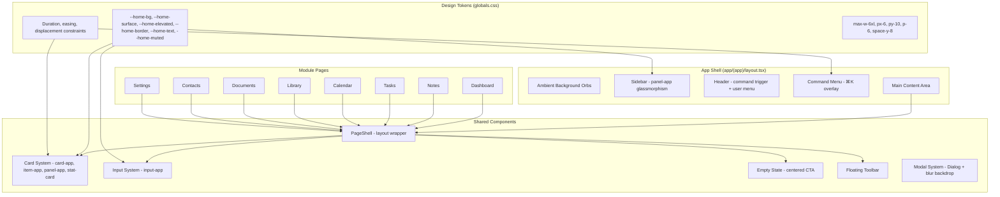

# Design Document: App UI Redesign

## Overview

This design transforms the Home OS internal application from a functional but visually disconnected dashboard into a cohesive, immersive operating system experience that maintains visual continuity with the landing page. The redesign operates entirely within the existing `(app)` route group, preserving the `(marketing)` route group unchanged.

The approach is additive — extending the existing design token system (`--home-*` variables), enhancing component classes (`card-app`, `panel-app`, `item-app`, `input-app`), and introducing new shared layout components (`PageShell`, floating toolbar, modal system) rather than replacing the architecture.

### Key Design Decisions

1. **Token-first approach**: All visual changes flow through CSS custom properties in `app/globals.css`, ensuring a single source of truth for the design system.
2. **Component class enhancement**: Existing classes (`card-app`, `panel-app`, etc.) are enhanced in-place rather than creating parallel systems.
3. **PageShell pattern**: A shared layout component enforces consistency across all modules without requiring each page to manually replicate spacing/header patterns.
4. **Progressive glassmorphism**: Translucent surfaces with backdrop-blur are used for depth, with automatic fallback for low-memory devices or unsupported browsers.
5. **Motion restraint**: Animations are limited to meaningful state changes with strict duration/displacement bounds and full `prefers-reduced-motion` support.

## Architecture



### Layer Hierarchy

The spatial design uses a clear z-index and opacity layering model:

| Layer | Element | Treatment |
|-------|---------|-----------|
| 0 (base) | `bg-app` background | Solid `--home-bg` (#09090b dark) |
| 1 (ambient) | Gradient orbs | `bg-blue-500/10`, `bg-purple-500/10`, `blur-3xl`, `pointer-events-none` |
| 2 (surface) | Cards, content areas | `--home-surface` at 70% opacity + `backdrop-blur-xl` |
| 3 (elevated) | Sidebar, panels | `--home-surface` at 85-95% opacity + `backdrop-blur-xl` |
| 4 (overlay) | Command Menu, modals | Full glassmorphism + `shadow-2xl` + backdrop overlay |

## Components and Interfaces

### PageShell Component

```typescript
// components/layout/page-shell.tsx
type PageShellProps = {
  title: string;
  description?: string;
  actions?: React.ReactNode;
  children: React.ReactNode;
};

export function PageShell({ title, description, actions, children }: PageShellProps): JSX.Element;
```

Renders:
- A `panel-app` header container with title (`text-4xl font-bold tracking-tight`), optional description (`text-app-muted`), and optional action buttons (right-aligned)
- A content area constrained to `max-w-6xl` with `px-6 py-10` padding
- Responsive sidebar integration (hidden below `md` breakpoint)

### Card System Variants

```typescript
// Component classes defined in globals.css @layer components

// card-app: Standard content card
// - border-radius: 1rem (rounded-2xl)
// - border: 1px solid var(--home-border)
// - background: color-mix(in srgb, var(--home-surface) 70%, transparent)
// - backdrop-filter: blur(16px)
// - box-shadow: 0 10px 30px rgba(0,0,0,0.08) | dark: rgba(0,0,0,0.45)
// - padding: 1.5rem (p-6)
// - hover: border opacity 10% → 20%, bg opacity 70% → 100%, 150-300ms ease

// item-app: Compact list item
// - border-radius: 0.75rem
// - border: 1px solid var(--home-border)
// - background: color-mix(in srgb, var(--home-elevated) 65%, transparent)
// - padding: 1rem (p-4)
// - hover: background → var(--home-elevated), 150ms ease

// panel-app: Large frosted panel
// - border-radius: 1.5rem
// - border: 1px solid var(--home-border)
// - background: color-mix(in srgb, var(--home-surface) 92%, transparent)
// - backdrop-filter: blur(16px)
// - padding: 1.5rem (p-6)

// stat-card: Numeric stat display
// - border-radius: 1rem
// - border: 1px solid var(--home-border)
// - background: var(--home-surface)
// - padding: 1rem (p-4)
// - value: text-2xl font-bold
// - label: text-sm text-app-muted
```

### Input System

```typescript
// input-app class in globals.css
// - border-radius: 0.75rem
// - border: 1px solid var(--home-border) at ≤10% opacity
// - background: var(--home-elevated)
// - color: var(--home-text)
// - placeholder: var(--home-muted)
// - focus: background shifts to higher-opacity elevated, no ring (focus-visible:ring-0)
// - focus indicator: background color shift meeting 3:1 contrast
// - at rest: no box-shadow, integrates with surrounding surface
```

### Empty State Component

```typescript
// components/shared/empty-state.tsx
type EmptyStateProps = {
  module: string;           // e.g. "notes", "tasks", "contacts"
  icon: React.ComponentType<{ className?: string }>;
  heading: string;          // max 60 chars, references module name
  body: string;             // max 120 chars, describes first action
  actionLabel: string;      // CTA button text
  onAction: () => void;     // creation flow trigger
};

export function EmptyState({ module, icon, heading, body, actionLabel, onAction }: EmptyStateProps): JSX.Element;
```

Renders centered content with:
- Icon at 48px using `text-app-muted`
- Heading and body text
- Single `btn-primary-app` CTA button
- Minimum 64px padding from container edges

### Modal System

```typescript
// components/shared/app-modal.tsx (wraps shadcn Dialog)
type AppModalProps = {
  open: boolean;
  onOpenChange: (open: boolean) => void;
  size?: "sm" | "md";      // sm: max-w-md (28rem), md: max-w-lg (32rem)
  children: React.ReactNode;
};

export function AppModal({ open, onOpenChange, size, children }: AppModalProps): JSX.Element;
```

Applies:
- Backdrop blur of 16px on overlay
- `panel-app` glassmorphism on dialog content
- Open/close animation: opacity + scale, 150-300ms
- Internal padding: 1.5rem

### Floating Toolbar

```typescript
// components/shared/floating-toolbar.tsx
type FloatingToolbarProps = {
  children: React.ReactNode;  // action buttons
  position?: "bottom" | "top";
};

export function FloatingToolbar({ children, position }: FloatingToolbarProps): JSX.Element;
```

Renders:
- `rounded-2xl` with `border-app` and `bg-app-surface`
- Horizontal button row with `gap-2`
- Fixed/sticky positioning within content area
- Buttons: icon-only with `aria-label` or icon + label

### Command Menu (Enhanced)

The existing `CommandMenu` component is enhanced with:
- `panel-app` glassmorphism surface (`backdrop-blur-2xl`, `border-white/10`, `shadow-2xl`, `rounded-2xl`)
- Blur-in entrance animation (150-300ms)
- Fade-out exit animation (150-300ms)
- Debounced search (≤500ms after last keystroke, currently 300ms — acceptable)
- Results grouped by category with heading labels and icons
- Keyboard navigation with visible focus indicator
- "No results" empty state when search returns zero matches
- Maximum 5 results per category (already implemented)

### Sidebar (Enhanced)

The existing `Sidebar` component is enhanced with:
- `backdrop-filter: blur(16px)` with 85-95% background opacity
- No visible right border (relies on translucent surface contrast)
- Active state: `bg-app-elevated` + 2px left border accent (no solid filled blocks)
- Hover: background opacity 0% → `bg-app-elevated`, 150-200ms ease
- Fixed width: 272px (within 256-288px range)
- Navigation items: `space-y-2` gap, 12px vertical padding each
- Brand: monospace font, font-semibold, 1.25-1.5rem size
- Tagline: `text-sm text-app-muted`
- Mobile: slide-out overlay below 768px via menu button

## Data Models

This feature does not introduce new database tables or modify existing data schemas. All changes are purely presentational — CSS tokens, component classes, and React component structure.

### Design Token Schema (CSS Custom Properties)

```css
/* Color tokens */
--home-bg: <color>          /* Primary background */
--home-surface: <color>     /* Card/panel surfaces */
--home-elevated: <color>    /* Hover states, inputs, nested surfaces */
--home-border: <color>      /* All borders (rgba with opacity) */
--home-text: <color>        /* Primary text */
--home-muted: <color>       /* Secondary/hint text */
--home-accent-glow: <color> /* Subtle accent glow */

/* Derived values (used in component classes) */
/* Surface at 70% opacity: color-mix(in srgb, var(--home-surface) 70%, transparent) */
/* Elevated at 65% opacity: color-mix(in srgb, var(--home-elevated) 65%, transparent) */
/* Panel at 92% opacity: color-mix(in srgb, var(--home-surface) 92%, transparent) */
```

### Motion Constraints Schema

```typescript
type MotionConstraints = {
  duration: { min: 150; max: 300 };        // ms
  hoverScale: { min: 1.02; max: 1.05 };
  hoverOpacityShift: { max: 0.1 };
  displacement: { max: 30 };               // px (translateX/Y)
  rotation: { max: 10 };                   // degrees
  backdropBlur: { overlay: { min: 4; max: 12 } };  // px
  easing: { entrance: "ease-out"; exit: "ease-in" };
};
```

### Spatial Constraints Schema

```typescript
type SpatialConstraints = {
  maxBlurLayers: 3;                        // simultaneous in viewport
  borderRadius: { min: 0.75 };             // rem, no 0px corners
  cardPadding: { standard: "1.5rem"; compact: "1rem" };
  pageMaxWidth: "72rem";                   // max-w-6xl
  pagePadding: { horizontal: "1.5rem"; vertical: "2.5rem" };
  sectionSpacing: "2rem";                  // space-y-8
  minSectionGap: "32px";
  minCardPadding: "24px";
};
```

## Correctness Properties

*A property is a characteristic or behavior that should hold true across all valid executions of a system — essentially, a formal statement about what the system should do. Properties serve as the bridge between human-readable specifications and machine-verifiable correctness guarantees.*

### Property 1: Color token constraint validation

*For any* color token value defined in the `--home-*` design token system, the token SHALL NOT be pure black (#000000) when used as a background or surface, SHALL NOT be a semantic hue (red, green, blue) when used for non-status purposes, and SHALL have saturation no greater than 60% when measured in the oklch color space.

**Validates: Requirements 2.2**

### Property 2: Typography scale ratio

*For any* pair of adjacent heading levels (h1/h2, h2/h3, h3/h4) in the typographic scale, the computed font-size of the higher-level heading SHALL be at least 1.25 times the computed font-size of the lower-level heading.

**Validates: Requirements 3.5**

### Property 3: Content container border-radius minimum

*For any* content container element rendered by the component system (card-app, item-app, panel-app, input-app, or any visible surface element), the computed border-radius SHALL be at least 0.75rem (12px) with no 0px or sharp 90-degree corners.

**Validates: Requirements 4.3**

### Property 4: Dashboard section item limits

*For any* dataset of user content (tasks, notes, books, contacts) regardless of total count, the dashboard SHALL display at most 8 focus tasks, at most 6 pinned/recent notes, at most 3 currently-reading books, and at most 4 favorite contacts.

**Validates: Requirements 8.1**

### Property 5: Time-aware greeting correctness

*For any* hour value in the range 0–23, the `greetingForHour` function SHALL return a morning greeting for hours 0–11, an afternoon greeting for hours 12–16, and an evening greeting for hours 17–23.

**Validates: Requirements 8.4**

### Property 6: Dashboard section ordering

*For any* set of tasks with due dates displayed in the focus section, the order SHALL be: overdue items first sorted by due date ascending, followed by non-overdue items sorted by due date ascending. *For any* set of notes or books displayed, the order SHALL be by `updated_at` descending (most recently updated first).

**Validates: Requirements 8.6**

### Property 7: Motion system parameter bounds

*For any* animation configuration in the motion system, the following constraints SHALL hold simultaneously: duration is between 150ms and 300ms for fade/reveal transitions (150ms–200ms for hover), scale transform is between 1.02 and 1.05, opacity shift is no greater than 0.1, translateX/translateY displacement does not exceed 30px, rotation does not exceed 10 degrees, and no spring/bounce easing is used.

**Validates: Requirements 9.1, 9.2, 9.4**

### Property 8: Motion easing direction correctness

*For any* entrance animation configuration, the easing function SHALL be `ease-out`. *For any* exit animation configuration, the easing function SHALL be `ease-in`.

**Validates: Requirements 9.6**

### Property 9: Empty state content validation

*For any* empty state configuration across all modules, the heading text SHALL be no more than 60 characters and SHALL contain the module name (e.g., "notes", "tasks", "contacts"), the body text SHALL be no more than 120 characters, and neither heading nor body SHALL contain the banned phrases "No data found", "Nothing here", "No items", or "Empty" as standalone text.

**Validates: Requirements 10.1, 10.4**

### Property 10: Cognitive load section limit

*For any* module page rendered at a standard viewport height (900px), the number of distinct interactive content sections visible simultaneously without scrolling SHALL NOT exceed 7.

**Validates: Requirements 13.1**

### Property 11: Spacing minimums

*For any* pair of adjacent top-level content sections on a module page, the vertical spacing SHALL be at least 32px. *For any* card or panel element, the internal padding SHALL be at least 24px.

**Validates: Requirements 13.2**

### Property 12: List display item limits

*For any* list section on any module page (excluding the dashboard which has its own limits), the number of displayed items SHALL NOT exceed 5, with full content accessible via user interaction.

**Validates: Requirements 13.3**

### Property 13: Command menu result category limits

*For any* search query executed in the Command Menu against any dataset, each result category (Tasks, Notes, Books, Contacts, Events, Documents) SHALL contain at most 5 items.

**Validates: Requirements 14.3**

### Property 14: Landing page token preservation

*For any* CSS custom property (`--home-*`, `--background`, `--foreground`, `--border`, `--muted`, `--muted-foreground`, `--primary`, `--primary-foreground`) referenced by landing page components, the computed value in the `(marketing)` route context SHALL remain identical after the redesign changes are applied.

**Validates: Requirements 15.3**

### Property 15: Text contrast ratio compliance

*For any* text element rendered on any surface in the redesigned application (including glassmorphism/translucent surfaces), the contrast ratio between the text color and its effective background SHALL be at least 4.5:1 for normal text (below 18px or below 14px bold) and at least 3:1 for large text (18px+ or 14px+ bold).

**Validates: Requirements 16.1, 16.6**

### Property 16: Focus indicator contrast

*For any* interactive element (including inputs, buttons, links, sidebar items, and command menu items), the visible focus indicator SHALL have a contrast ratio of at least 3:1 against adjacent colors, ensuring the focus state is perceivable for keyboard users.

**Validates: Requirements 6.3, 16.3**

### Property 17: Icon-only elements have accessible labels

*For any* interactive element (button or link) that contains only an icon with no visible text content, the element SHALL have a descriptive `aria-label` attribute that conveys the action.

**Validates: Requirements 16.5**

### Property 18: Maximum simultaneous blur layers

*For any* page state in any module, the number of simultaneously visible elements with `backdrop-filter: blur()` applied SHALL NOT exceed 3.

**Validates: Requirements 17.1**

### Property 19: Animation uses only non-layout-triggering properties

*For any* animation or transition in the motion system, only `transform` and `opacity` properties SHALL be animated. Layout-triggering properties (`width`, `height`, `top`, `left`, `margin`, `padding`) SHALL NOT be animated.

**Validates: Requirements 17.2**

### Property 20: Interactive element minimum touch target

*For any* interactive element (button, link, input, or clickable area) in the application, the computed dimensions SHALL be at least 44×44 CSS pixels.

**Validates: Requirements 17.4**

## Error Handling

### Graceful Degradation

| Condition | Behavior |
|-----------|----------|
| `navigator.deviceMemory ≤ 4` or no `backdrop-filter` support | Disable all backdrop-blur effects; use solid backgrounds; limit box-shadow to single layer |
| `prefers-reduced-motion: reduce` | Skip all animations; display elements in final state immediately; preserve focus indicators |
| Viewport < 768px | Collapse sidebar to slide-out overlay; show menu button trigger |
| Viewport < 375px | Content remains accessible with no horizontal overflow |
| CSS custom property unsupported | Fallback values defined inline in component classes |

### Component Error States

- **PageShell**: If title prop is missing, renders with a default "Untitled" heading rather than crashing
- **EmptyState**: If icon prop is missing, renders without icon rather than throwing
- **CommandMenu**: If search fails (network error), shows "Search unavailable" message and preserves quick actions/navigation
- **Modal**: If content exceeds viewport height, enables internal scrolling with max-height constraint

### Token Fallbacks

All `--home-*` tokens have both `:root` (light) and `.dark` (dark) definitions. If a token is undefined (e.g., due to CSS load failure), components use hardcoded fallback values:

```css
background-color: var(--home-surface, #111118);
color: var(--home-text, #fafafa);
border-color: var(--home-border, rgba(255, 255, 255, 0.1));
```

## Testing Strategy

### Property-Based Tests (fast-check)

Property-based testing is appropriate for this feature in specific areas:
- **Design token validation**: Color constraints, contrast ratios (pure computation on color values)
- **Motion system constraints**: Animation parameter bounds (pure validation of config objects)
- **Content constraints**: Empty state text limits, dashboard item limits, list display limits
- **Ordering logic**: Dashboard section sorting (pure function testing)
- **Accessibility checks**: Contrast ratios, touch target sizes, aria-label presence

**Library**: fast-check (already in project)
**Minimum iterations**: 100 per property test
**Tag format**: `Feature: app-ui-redesign, Property {number}: {property_text}`

Each correctness property maps to a single property-based test that generates random valid inputs and verifies the constraint holds universally.

### Unit Tests (example-based)

Unit tests cover specific rendering scenarios:
- PageShell renders correct structure with title, description, and actions
- Card variants (card-app, item-app, panel-app, stat-card) render with correct classes
- EmptyState renders icon, heading, body, and CTA button
- Sidebar renders active state for current route
- Command menu opens on ⌘K and closes on Escape
- Modal renders at correct size variants
- Floating toolbar renders horizontal button row
- Reduced motion disables hover transitions
- Low-memory fallback disables backdrop-blur

### Integration Tests

- Navigation from landing page to app maintains visual continuity (same tokens resolve)
- Command menu search returns grouped results from Supabase
- Sidebar active state updates on route change
- Empty state CTA triggers correct creation flow per module
- PageShell responsive behavior at breakpoints

### Visual Regression Tests

- Snapshot tests for each module page in both light and dark mode
- Snapshot tests for landing page (must remain unchanged)
- Component snapshots for all card variants, input states, empty states

### Accessibility Tests

- axe-core automated checks on all module pages
- Keyboard navigation flow verification
- Screen reader announcement testing for dynamic content (command menu results, toast notifications)
- Focus trap verification in modals and command menu

