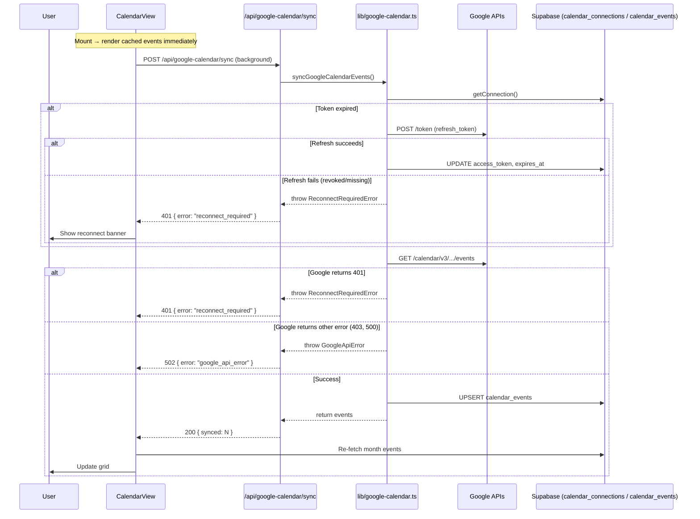

# Design Document

## Overview

This design addresses five incremental improvements to the existing Google Calendar integration in Home OS. The changes are scoped to modifying existing files rather than introducing new architecture. The core modifications are:

1. **OAuth Callback** — After exchanging the authorization code for tokens, fetch the user's Google email via the userinfo endpoint and persist it in `calendar_connections.connected_email`.
2. **Token Refresh Hardening** — Differentiate between refreshable token expiry and irrecoverable token revocation. Surface `reconnect_required` errors as HTTP 401 instead of the current catch-all HTTP 400.
3. **Sync Endpoint Error Handling** — Return structured error codes (404 not_connected, 401 reconnect_required, 502 google_api_error) so the client can respond appropriately.
4. **Background Sync** — Trigger a non-blocking sync on CalendarView mount so events appear without manual button clicks.
5. **Reconnection UI** — Show a non-intrusive toast/banner when the sync returns `reconnect_required`.

All changes touch existing files: `lib/google-calendar.ts`, the callback/sync route handlers, and `components/calendar/calendar-view.tsx`.

## Architecture



### Design Decisions

| Decision | Choice | Rationale |
|----------|--------|-----------|
| Fetch email method | Google Userinfo endpoint (`/oauth2/v2/userinfo`) | Simpler than tokeninfo; returns email directly; already covered by the `openid email` scope we can add. No extra library needed — just a fetch call. |
| Error differentiation | Custom error classes (`ReconnectRequiredError`, `GoogleApiError`) | Allows the sync route handler to map errors to specific HTTP status codes without string-matching error messages. |
| Background sync trigger | `useEffect` on mount with `useRef` guard | Ensures exactly one sync per mount. No external state library needed. Aligns with existing `useState`/`useCallback` patterns in the component. |
| Reconnection UI | Toast via Sonner + inline banner | Toast for transient awareness; inline banner persists on the page so the user can act on it. Consistent with existing toast usage throughout the app. |
| Sync response shape change | Return `{ synced: N }` instead of `{ events: [...] }` | Reduces payload size. The client already re-fetches from the DB after sync completes. |

## Components and Interfaces

### Modified: `lib/google-calendar.ts`

**New exports:**

```typescript
// Custom error classes for structured error handling
export class ReconnectRequiredError extends Error {
  constructor(message?: string) {
    super(message || "Google Calendar reconnection required");
    this.name = "ReconnectRequiredError";
  }
}

export class GoogleApiError extends Error {
  public statusCode: number;
  constructor(statusCode: number, message: string) {
    super(message);
    this.name = "GoogleApiError";
    this.statusCode = statusCode;
  }
}

// Fetch the authenticated user's email from Google
export async function fetchGoogleUserEmail(accessToken: string): Promise<string | null>

// Updated signature — now throws typed errors instead of generic Error
export async function syncGoogleCalendarEvents(params: {
  supabase: SupabaseClient;
  userId: string;
  requestUrl: string;
  timeRange?: { timeMin: string; timeMax: string };
}): Promise<{ synced: number }>
```

**Modified internals:**

- `refreshConnectionToken` — throws `ReconnectRequiredError` when refresh_token is missing or Google returns an error on refresh.
- `syncGoogleCalendarEvents` — after fetching events, if Google returns 401, throws `ReconnectRequiredError`. For other non-OK responses (403, 500, etc.), throws `GoogleApiError`.
- `saveGoogleCalendarConnection` — accepts optional `connectedEmail` parameter to persist alongside tokens.

### Modified: `app/api/google-calendar/callback/route.ts`

After `exchangeGoogleCalendarCode`, call `fetchGoogleUserEmail(token.access_token)` and pass the result to `saveGoogleCalendarConnection`. If the userinfo fetch fails, log a warning and pass `null` — the connection still saves.

### Modified: `app/api/google-calendar/sync/route.ts`

Replace the single catch-all `catch` block with typed error handling:

```typescript
try {
  const result = await syncGoogleCalendarEvents({ supabase, userId, requestUrl });
  return NextResponse.json({ synced: result.synced });
} catch (error) {
  if (error instanceof ReconnectRequiredError) {
    return NextResponse.json({ error: "reconnect_required" }, { status: 401 });
  }
  if (error instanceof GoogleApiError) {
    return NextResponse.json(
      { error: "google_api_error", message: error.message },
      { status: 502 }
    );
  }
  // Connection not found
  if (error instanceof Error && error.message === "not_connected") {
    return NextResponse.json({ error: "not_connected" }, { status: 404 });
  }
  return NextResponse.json(
    { error: "sync_failed", message: error instanceof Error ? error.message : "Unknown error" },
    { status: 500 }
  );
}
```

### Modified: `components/calendar/calendar-view.tsx`

**New state:**

```typescript
const [backgroundSyncing, setBackgroundSyncing] = useState(false);
const [reconnectRequired, setReconnectRequired] = useState(false);
const hasSyncedRef = useRef(false);
```

**New behavior:**

- `useEffect` on mount: if `googleCalendarConnected && !hasSyncedRef.current`, trigger background sync. Set `hasSyncedRef.current = true` immediately to prevent duplicates.
- During background sync: show a subtle spinning indicator in the toolbar (reuse existing `RefreshCw` icon with `animate-spin`).
- On 401 response: set `reconnectRequired = true`, display an inline banner below the toolbar.
- On other errors: show a toast via Sonner, continue displaying cached events.
- On success: call `fetchMonthEvents(year, month)` to refresh the grid.

**Reconnect banner component (inline in same file):**

```tsx
{reconnectRequired && (
  <div className="flex items-center gap-3 rounded-xl border border-amber-500/30 bg-amber-500/10 px-4 py-3 text-sm text-amber-600 dark:text-amber-300">
    <span>Google Calendar needs to be reconnected.</span>
    <a
      href="/api/google-calendar/connect"
      className="font-medium underline underline-offset-2"
    >
      Reconnect
    </a>
  </div>
)}
```

### Modified: `app/api/google-calendar/connect/route.ts`

Add `email` to the OAuth scope so the userinfo endpoint returns the user's email:

```typescript
const GOOGLE_CALENDAR_SCOPE =
  "https://www.googleapis.com/auth/calendar.events.readonly https://www.googleapis.com/auth/userinfo.email";
```

## Data Models

### Existing Table: `calendar_connections`

No schema changes required. The `connected_email` column already exists (added in migration `20260515010000_google_calendar_v3.sql`). Currently it is never populated — the callback will now write to it.

| Column | Type | Change |
|--------|------|--------|
| `connected_email` | `text` (nullable) | **Now populated** during OAuth callback |

### Existing Table: `calendar_events`

No schema changes. The `source` column already distinguishes `'home_os'` from `'google'` events.

### API Response Contracts

| Endpoint | Status | Body |
|----------|--------|------|
| `POST /api/google-calendar/sync` | 200 | `{ "synced": number }` |
| | 401 | `{ "error": "reconnect_required" }` |
| | 404 | `{ "error": "not_connected" }` |
| | 502 | `{ "error": "google_api_error", "message": string }` |
| | 500 | `{ "error": "sync_failed", "message": string }` |

### Type Additions (in `lib/google-calendar.ts`)

```typescript
type SyncResult = {
  synced: number;
};

type SyncErrorResponse = {
  error: "reconnect_required" | "not_connected" | "google_api_error" | "sync_failed";
  message?: string;
};
```


## Correctness Properties

*A property is a characteristic or behavior that should hold true across all valid executions of a system — essentially, a formal statement about what the system should do. Properties serve as the bridge between human-readable specifications and machine-verifiable correctness guarantees.*

### Property 1: Token failures always produce 401 reconnect_required

*For any* token-related failure scenario (missing refresh token, revoked refresh token, invalid_grant response from Google, or Google Calendar API returning 401 after refresh), the sync endpoint SHALL return HTTP 401 with `{ "error": "reconnect_required" }` and SHALL never return HTTP 400.

**Validates: Requirements 2.3, 2.4, 2.6**

### Property 2: Non-401 Google API errors produce 502

*For any* Google Calendar API error response with a status code that is not 401 (e.g., 403, 429, 500, 502, 503), the sync endpoint SHALL return HTTP 502 with `{ "error": "google_api_error", "message": <description> }`.

**Validates: Requirements 4.2**

### Property 3: Synced count equals the number of events with valid start dates

*For any* set of Google Calendar events returned by the API (including events with missing start dates, all-day events, and timed events), the `synced` count in the 200 response SHALL equal the number of events that have a non-null start date (either `start.date` or `start.dateTime`).

**Validates: Requirements 4.3, 4.4**

### Property 4: Background sync fires exactly once per mount

*For any* sequence of React re-renders of the CalendarView component (caused by state changes, prop updates, or parent re-renders), the background sync request to `/api/google-calendar/sync` SHALL be triggered exactly once per component mount when `googleCalendarConnected` is true.

**Validates: Requirements 3.6**

## Error Handling

### Error Classification Strategy

Errors are classified at the library level using custom error classes, then mapped to HTTP responses at the route handler level:

| Error Source | Error Class | HTTP Status | Response Body |
|---|---|---|---|
| Missing/revoked refresh token | `ReconnectRequiredError` | 401 | `{ "error": "reconnect_required" }` |
| Google Calendar API 401 | `ReconnectRequiredError` | 401 | `{ "error": "reconnect_required" }` |
| Google Calendar API 403/429/5xx | `GoogleApiError` | 502 | `{ "error": "google_api_error", "message": "..." }` |
| No connection record | `Error("not_connected")` | 404 | `{ "error": "not_connected" }` |
| Unexpected errors | `Error` | 500 | `{ "error": "sync_failed", "message": "..." }` |

### Graceful Degradation

- **Userinfo fetch failure**: The OAuth callback logs a warning and saves the connection with `connected_email = null`. The user can still sync events — they just won't see which email is connected until they reconnect.
- **Events without start dates**: Skipped silently during sync. A `console.warn` is logged for debugging but the sync continues for all other events.
- **Background sync failure**: Cached events from the database remain visible. The user sees either a toast (transient error) or a reconnect banner (auth error) but is never left with a blank calendar.

### Client-Side Error Handling

The CalendarView handles sync responses as follows:

```typescript
// In the background sync effect
if (response.status === 401) {
  const data = await response.json();
  if (data.error === "reconnect_required") {
    setReconnectRequired(true);
  }
} else if (!response.ok) {
  toast.error("Could not sync Google Calendar");
}
// On success: refresh events from DB
```

The reconnect banner is dismissible but persists across re-renders until the user reconnects or navigates away.

## Testing Strategy

### Unit Tests (Example-Based)

| Test | What it verifies |
|------|-----------------|
| `fetchGoogleUserEmail` returns email on success | Mocked userinfo endpoint returns `{ email: "x@gmail.com" }` |
| `fetchGoogleUserEmail` returns null on failure | Mocked userinfo endpoint returns 500 |
| Callback saves email to connection | End-to-end callback flow with mocked Google APIs |
| Sync returns 404 when not connected | No connection row in DB |
| Sync returns 200 with synced count | Mocked Google events response |
| CalendarView triggers background sync on mount | Component test with mocked fetch |
| CalendarView shows reconnect banner on 401 | Component test with mocked 401 response |
| CalendarView shows toast on non-401 error | Component test with mocked 502 response |
| Settings shows connected email | Render with email prop |

### Property-Based Tests

Property-based testing is applicable here for the error classification and event filtering logic — these are pure functions with clear input/output behavior where input variation reveals edge cases.

**Library**: `fast-check` (TypeScript PBT library, well-suited for Next.js/Vitest projects)

**Configuration**: Minimum 100 iterations per property test.

**Tag format**: `Feature: calm-home-os, Property {number}: {property_text}`

| Property | Generator Strategy |
|----------|-------------------|
| Property 1: Token failures → 401 | Generate arbitrary token failure reasons (enum of: missing_refresh, revoked_refresh, invalid_grant, calendar_401_after_refresh). For each, verify the sync function throws `ReconnectRequiredError` and the route handler maps it to 401. |
| Property 2: Non-401 Google errors → 502 | Generate random HTTP status codes in {400, 403, 404, 429, 500, 502, 503} (excluding 401). Mock Google API to return that status. Verify route handler returns 502. |
| Property 3: Synced count = valid events | Generate arrays of `GoogleCalendarEvent` objects where `start` is randomly either `{ dateTime: <iso> }`, `{ date: <date> }`, or `undefined`/`null`. Verify synced count equals events where start is defined. |
| Property 4: Sync fires once per mount | Generate random sequences of state updates (0–10 re-renders). Verify fetch is called exactly once. |

### Integration Tests

| Test | What it verifies |
|------|-----------------|
| Full OAuth callback flow | Code exchange → userinfo fetch → save connection → initial sync |
| Token refresh flow | Expired token → refresh → successful sync |
| Month navigation loads correct events | Navigate months, verify correct date range queries |

### Test Runner Setup

The project currently has no test runner. Add Vitest (compatible with Next.js App Router):

```bash
npm install -D vitest @vitejs/plugin-react jsdom @testing-library/react @testing-library/jest-dom fast-check
```

Configure in `vitest.config.ts` with `jsdom` environment for component tests and `node` environment for API/lib tests.
