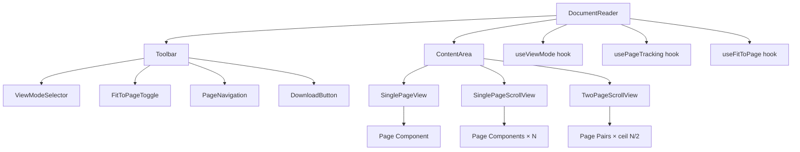

# Design Document: Document Reader View Modes

## Overview

This feature extends the existing `DocumentReader` component to support multiple view modes (single page, single page scroll, two page scroll) and a fit-to-page scaling toggle. The design keeps all changes contained within the `DocumentReader` component and its internal subcomponents, requiring no changes to parent pages or data models.

The implementation leverages react-pdf v10's `Document` and `Page` components, adding state management for view modes and responsive scaling logic. The toolbar is reorganized to group view controls separately from navigation controls, following the project's accessibility patterns.

## Architecture



### Design Decisions

1. **Single component boundary**: All view mode logic lives inside `DocumentReader`. Parent pages pass the same `{ url, title }` props unchanged. This avoids breaking the shared component contract between `/reader/[id]` and `/documents/[id]`.

2. **Conditional rendering over route-based splitting**: Rather than creating separate components per view mode, a single content area conditionally renders the appropriate layout. The PDF `Document` component wraps all views, avoiding re-fetching the file on mode switch.

3. **Custom hooks for concerns**: View mode state, page tracking (scroll-based), and fit-to-page scaling are separated into focused hooks that compose within the main component.

4. **Scroll-based page tracking**: In scroll modes, an `IntersectionObserver` determines the most-visible page. This avoids expensive scroll-position calculations and provides smooth updates.

5. **Viewport resize handling**: A `ResizeObserver` on the content container recalculates page width when fit-to-page is enabled, debounced to 200ms per the requirement.

## Components and Interfaces

### DocumentReader (enhanced)

The root component orchestrates state and delegates rendering:

```typescript
type ViewMode = "single-page" | "single-scroll" | "two-page-scroll"

type DocumentReaderProps = {
  url: string
  title: string
}
```

### Internal Components

#### ViewModeSelector

A segmented control with three icon buttons (one per mode). Uses `aria-label` on each button indicating mode name and selection state.

```typescript
type ViewModeSelectorProps = {
  currentMode: ViewMode
  onModeChange: (mode: ViewMode) => void
}
```

#### FitToPageToggle

A toggle button using `aria-pressed` to indicate state. Uses the `Maximize` or `Minimize` icon from Lucide.

```typescript
type FitToPageToggleProps = {
  enabled: boolean
  onToggle: () => void
}
```

#### SinglePageView

Renders a single `Page` at `currentPage`. Shows prev/next buttons. Existing behavior, extracted for clarity.

#### SinglePageScrollView

Renders all pages in a vertical stack with 24px gap. Uses `IntersectionObserver` to track the most-visible page and update the toolbar page number.

#### TwoPageScrollView

Renders pages in rows: page 1 alone, then pairs (2,3), (4,5), etc. Last page alone if odd count. Uses `IntersectionObserver` to track the most-visible row and display the page range.

### Custom Hooks

#### useViewMode

```typescript
function useViewMode(): {
  viewMode: ViewMode
  setViewMode: (mode: ViewMode) => void
}
```

Manages the current view mode state. Defaults to `"single-page"`.

#### usePageTracking

```typescript
function usePageTracking(
  viewMode: ViewMode,
  numPages: number,
  containerRef: RefObject<HTMLDivElement>
): {
  currentPage: number
  displayLabel: string // "3" or "2–3"
  scrollToPage: (page: number) => void
}
```

In single-page mode, uses the existing `currentPage` state. In scroll modes, observes page elements via `IntersectionObserver` to determine the most-visible page/pair. Provides `scrollToPage` for direct navigation via the page input.

#### useFitToPage

```typescript
function useFitToPage(
  containerRef: RefObject<HTMLDivElement>,
  viewMode: ViewMode
): {
  fitToPage: boolean
  toggleFitToPage: () => void
  pageWidth: number | undefined // undefined means intrinsic width
}
```

Calculates the appropriate page width based on container dimensions. Uses `ResizeObserver` debounced at 200ms. For two-page mode, accounts for gap between pages so both fit side by side. Returns `undefined` for `pageWidth` when fit-to-page is disabled (renders at intrinsic size).

### Toolbar Layout

```
┌─────────────────────────────────────────────────────────────────────────┐
│ [Single] [Scroll] [TwoPage]  |  [FitToPage]  │  [◀] [page/total] [▶]  │  [↓] │
│ ←── view controls ──────────────────────────→   ←── navigation ────→   │  dl  │
└─────────────────────────────────────────────────────────────────────────┘
```

On viewports < 768px, the view mode selector collapses into a dropdown menu. The toolbar uses `role="toolbar"` with `aria-label="Document reader controls"`.

## Data Models

This feature introduces no new database tables, API routes, or server-side state. All state is local to the `DocumentReader` component instance.

### Internal State Shape

```typescript
type DocumentReaderState = {
  // PDF state
  numPages: number
  loadError: boolean
  
  // View mode
  viewMode: ViewMode         // "single-page" | "single-scroll" | "two-page-scroll"
  
  // Page tracking
  currentPage: number        // 1-indexed, primary page in view
  pageInput: string          // text input value for direct navigation
  
  // Fit to page
  fitToPage: boolean         // defaults to true
  containerWidth: number     // measured via ResizeObserver
  computedPageWidth: number | undefined // undefined = intrinsic size
}
```

### ViewMode Type

```typescript
type ViewMode = "single-page" | "single-scroll" | "two-page-scroll"
```

### Page Pairing Logic (Two Page Scroll)

```typescript
function computePagePairs(numPages: number): Array<[number] | [number, number]> {
  const pairs: Array<[number] | [number, number]> = [[1]]
  for (let i = 2; i <= numPages; i += 2) {
    if (i + 1 <= numPages) {
      pairs.push([i, i + 1])
    } else {
      pairs.push([i])
    }
  }
  return pairs
}
```

### Page Width Calculation

```typescript
function computeFitWidth(
  containerWidth: number,
  viewMode: ViewMode,
  padding: number = 48 // 24px each side
): number {
  const available = containerWidth - padding
  if (viewMode === "two-page-scroll") {
    const gap = 16 // gap between pages
    return Math.floor((available - gap) / 2)
  }
  return available
}
```

### Most-Visible Page Determination

For scroll modes, the "current page" is determined by which page element has its vertical center closest to the viewport's vertical center. This uses `IntersectionObserver` entries with threshold arrays to track visibility ratios, then selects the page with the highest intersection ratio.


## Correctness Properties

*A property is a characteristic or behavior that should hold true across all valid executions of a system — essentially, a formal statement about what the system should do. Properties serve as the bridge between human-readable specifications and machine-verifiable correctness guarantees.*

### Property 1: View mode switch does not reload the PDF document

*For any* pair of view modes (A, B) where A ≠ B, switching from mode A to mode B shall not trigger a re-fetch or re-parse of the PDF file. The Document component instance remains mounted and the `onLoadSuccess` callback is not invoked again after the mode switch.

**Validates: Requirements 1.2**

### Property 2: Switching to single-page mode preserves the most-visible page

*For any* page number N in [1, numPages] that was the most-visible page in a scroll mode, switching to Single_Page_Mode shall set `currentPage` to N.

**Validates: Requirements 1.4**

### Property 3: Switching from single-page to a scroll mode scrolls to the current page

*For any* page number N in [1, numPages] that is the current page in Single_Page_Mode, and *for any* target scroll mode (single-scroll or two-page-scroll), the transition shall invoke a scroll operation positioning page N at the top of the viewport.

**Validates: Requirements 1.5**

### Property 4: Most-visible page determination

*For any* set of page elements with known vertical positions and heights, and *for any* viewport scroll position, the most-visible page function shall return the page index whose vertical center is closest to the viewport's vertical center.

**Validates: Requirements 2.3, 3.3**

### Property 5: Page pairing algorithm correctness

*For any* numPages ≥ 1, `computePagePairs(numPages)` shall satisfy:
- The first element is always `[1]` (page 1 alone)
- Subsequent elements are pairs `[2k, 2k+1]` for k = 1, 2, 3, ...
- If numPages is even, the last element is a pair; if numPages is odd and numPages > 1, the last element is a singleton
- Flattening all pairs produces exactly the sequence [1, 2, 3, ..., numPages]
- No page number appears more than once

**Validates: Requirements 3.1, 3.2**

### Property 6: Page range display label formatting

*For any* page pair `[n]`, the display label shall be the string `"n"`. *For any* page pair `[n, m]` where m = n + 1, the display label shall be the string `"n–m"` (using an en-dash).

**Validates: Requirements 3.3**

### Property 7: Page input validation and clamping

*For any* input string S and *for any* numPages ≥ 1 and currentPage in [1, numPages]:
- If `parseInt(S, 10)` is an integer in [1, numPages], the result shall be that integer
- If `parseInt(S, 10)` is an integer < 1, the result shall be 1
- If `parseInt(S, 10)` is an integer > numPages, the result shall be numPages
- If S is non-numeric (NaN), the result shall be `currentPage` (revert)

**Validates: Requirements 4.6**

### Property 8: Fit-to-page width calculation prevents horizontal overflow

*For any* container width > 0, *for any* view mode, and *for any* padding value ≥ 0:
- In single-page or single-scroll mode: `computeFitWidth(containerWidth, mode, padding)` ≤ containerWidth - padding
- In two-page-scroll mode: `computeFitWidth(containerWidth, mode, padding) * 2 + gap` ≤ containerWidth - padding
- The computed width is always > 0

**Validates: Requirements 5.2, 5.6, 3.5**

### Property 9: Fit-to-page state preservation across mode switches

*For any* sequence of view mode changes and *for any* initial fit-to-page state (true or false), the fit-to-page value shall remain unchanged after each mode switch unless the user explicitly toggles it.

**Validates: Requirements 5.5**

### Property 10: Toolbar interactive controls meet minimum touch target size

*For any* interactive control element in the Document_Reader toolbar (view mode buttons, fit-to-page toggle, navigation buttons, page input, download link), the effective computed dimensions shall be at least 44×44 CSS pixels.

**Validates: Requirements 6.6**

## Error Handling

| Scenario | Behavior |
|----------|----------|
| PDF fails to load | Show error state with download fallback link (existing behavior, unchanged) |
| Invalid page input in single-page mode | Revert input to current page number, no navigation |
| Page input out of range | Clamp to [1, numPages] |
| Container width is 0 or unmeasured | Defer rendering until container dimensions are available; show loading spinner |
| ResizeObserver not supported | Fall back to window resize event with same debounce logic |
| IntersectionObserver not supported | Fall back to scroll event listener with manual visibility calculation |
| Very large PDFs (100+ pages) in scroll mode | Rely on react-pdf's built-in virtualization. If performance degrades, consider rendering only visible pages ± buffer |
| Single page document in two-page mode | Render page 1 alone with no empty placeholder (per requirement 1.7) |

## Testing Strategy

### Unit Tests (Example-Based)

- Default state: component loads in single-page mode with fit-to-page enabled
- View mode selector renders all three mode options
- Navigation buttons hidden in scroll modes, visible in single-page mode
- Navigation buttons disabled at boundaries (first/last page)
- Toolbar has `role="toolbar"` and proper `aria-label`
- View mode buttons have correct `aria-label` including selection state
- Fit-to-page toggle uses `aria-pressed` correctly
- Single-page document in two-page mode renders only one page
- Error state shows download fallback

### Property-Based Tests (fast-check)

**Library**: fast-check v4  
**Minimum iterations**: 100 per property  
**Tag format**: `Feature: document-reader-view-modes, Property {N}: {title}`

Each correctness property (1–10) will be implemented as a property-based test with generated inputs:

- **Property 5** (page pairing): Generate random `numPages` from 1 to 500, verify pairing invariants
- **Property 6** (display label): Generate random page pairs, verify formatting
- **Property 7** (page input): Generate random strings (numeric, non-numeric, edge cases) and random `numPages`, verify clamping/reversion logic
- **Property 8** (fit width): Generate random container widths (1–3000px), padding values, and view modes, verify no overflow
- **Property 4** (most-visible page): Generate random page positions and viewport scroll positions, verify closest-center selection
- **Properties 2, 3** (mode switch context): Generate random page numbers and mode transitions, verify page preservation
- **Property 9** (fit state preservation): Generate random sequences of mode switches, verify fitToPage unchanged
- **Property 1** (no reload): Generate random mode transition sequences, verify document stability
- **Property 10** (touch targets): Model toolbar element configs, verify 44×44px minimum

### Integration Tests

- Viewport resize triggers recalculation when fit-to-page enabled
- Scroll position updates page number in toolbar (scroll modes)
- Mode switch animation completes within 300ms budget
- Responsive toolbar behavior at < 768px viewport
