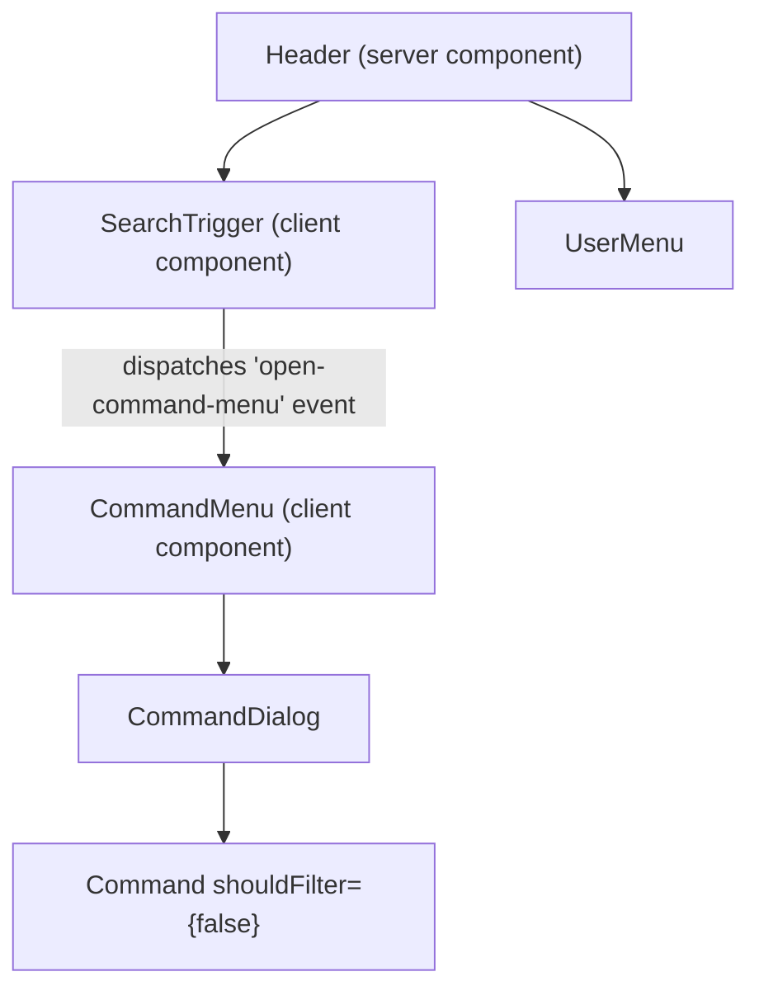

# Design Document: Fix Command Menu Search

## Overview

The command menu has two usability bugs: (1) cmdk's built-in client-side filtering hides server-returned search results, and (2) there's no clickable trigger to open the menu. This design addresses both by disabling client-side filtering and adding a `SearchTrigger` button in the header that communicates with the `CommandMenu` via a custom DOM event.

## Architecture

The fix involves minimal changes to the existing component tree:



**State communication pattern:** Custom DOM event (`open-command-menu`). This avoids new dependencies, keeps components loosely coupled, and allows the Header to remain a server component.

**Why not Zustand?** The interaction is fire-and-forget (trigger → open). There's no shared state to subscribe to — just a one-way signal. A custom event is simpler and sufficient.

## Components and Interfaces

### Modified: `components/ui/command.tsx` — CommandDialog

The `CommandDialog` component needs to accept and forward a `shouldFilter` prop to the inner `Command` component.

```typescript
type CommandDialogProps = React.ComponentProps<typeof Dialog> & {
  title?: string
  description?: string
  className?: string
  showCloseButton?: boolean
  shouldFilter?: boolean  // NEW: forwarded to Command
}

function CommandDialog({
  title = "Command Palette",
  description = "Search for a command to run...",
  children,
  className,
  showCloseButton = false,
  shouldFilter,  // NEW
  ...props
}: CommandDialogProps) {
  return (
    <Dialog {...props}>
      {/* ... */}
      <DialogContent>
        <Command shouldFilter={shouldFilter}>
          {children}
        </Command>
      </DialogContent>
    </Dialog>
  )
}
```

Since `Command` already spreads `...props` onto `CommandPrimitive`, the `shouldFilter` prop will reach cmdk's root component.

### Modified: `components/layout/command-menu.tsx` — CommandMenu

Two changes:
1. Pass `shouldFilter={false}` to `CommandDialog`
2. Add an event listener for `'open-command-menu'` that calls `setOpen(true)`

```typescript
// In CommandMenu component:

// 1. Pass shouldFilter={false}
<CommandDialog shouldFilter={false} open={open} onOpenChange={handleOpenChange}>

// 2. Listen for custom event
React.useEffect(() => {
  const handleOpenEvent = () => setOpen(true);
  window.addEventListener('open-command-menu', handleOpenEvent);
  return () => window.removeEventListener('open-command-menu', handleOpenEvent);
}, []);
```

### New: `components/layout/search-trigger.tsx` — SearchTrigger

A client component that renders a button styled like a muted search input placeholder.

```typescript
"use client";

import { Search } from "lucide-react";

export function SearchTrigger() {
  const handleClick = () => {
    window.dispatchEvent(new Event('open-command-menu'));
  };

  return (
    <button
      type="button"
      onClick={handleClick}
      aria-label="Search"
      className="hidden items-center gap-2 rounded-xl border border-app bg-app-elevated px-3 py-1.5 text-sm text-app-muted transition-colors hover:bg-app-elevated/80 sm:inline-flex"
    >
      <Search className="size-4" aria-hidden="true" />
      <span>Search...</span>
      <kbd className="ml-2 rounded-md border border-app bg-app-surface px-1.5 py-0.5 text-xs">
        ⌘K
      </kbd>
    </button>
  );
}
```

### Modified: `components/layout/header.tsx` — Header

Replace the standalone `<kbd>` element with the new `<SearchTrigger />` component. The Header remains a server component.

```typescript
import { MobileSidebar } from "./mobile-sidebar";
import { UserMenu } from "./user-menu";
import { SearchTrigger } from "./search-trigger";

export function Header() {
  return (
    <header className="sticky top-0 z-40 flex h-16 items-center justify-between border-b border-app bg-app-surface/80 px-6 backdrop-blur-xl">
      <div className="flex items-center gap-4">
        <MobileSidebar />
      </div>
      <div className="flex items-center gap-3">
        <SearchTrigger />
        <UserMenu />
      </div>
    </header>
  );
}
```

## Data Models

No data model changes. The existing search result types and Supabase queries remain unchanged. The fix is purely at the UI/component layer.

## Correctness Properties

*A property is a characteristic or behavior that should hold true across all valid executions of a system — essentially, a formal statement about what the system should do. Properties serve as the bridge between human-readable specifications and machine-verifiable correctness guarantees.*

### Property 1: Server results are never filtered out by the client

*For any* set of search result items returned by the server, when `shouldFilter` is `false`, the number of items passed to the rendering logic SHALL equal the number of items returned by the server — no items are removed by cmdk's client-side filter regardless of whether their title matches the search query text.

**Validates: Requirements 1.2**

### Property 2: Content type icon mapping is total

*For any* valid content type in the set {task, note, book, contact, event, document}, the icon mapping SHALL return a defined, non-null icon component.

**Validates: Requirements 4.3**

### Property 3: Non-empty query hides default groups

*For any* non-empty, non-whitespace search string, the command menu state logic SHALL indicate that default groups (Quick Actions, Go To) should be hidden and the search results area should be shown.

**Validates: Requirements 5.3**

## Error Handling

| Scenario | Handling |
|----------|----------|
| Search query fails (network error) | Existing: `console.error` + loading state clears. No change needed. |
| Custom event not supported | All modern browsers support `CustomEvent`/`Event`. No fallback needed. |
| CommandMenu not mounted when event fires | Event is simply not received — no error. Menu won't open, but keyboard shortcut still works. |
| Empty search results | Existing empty state UI ("No results found") is displayed. |

## Testing Strategy

### Property-Based Tests (fast-check)

Property tests validate universal correctness properties. Each runs minimum 100 iterations.

- **Property 1**: Generate random arrays of search result items with titles that do NOT match a given query string. Verify that the display logic (with `shouldFilter=false`) preserves all items.
- **Property 2**: Generate random content types from the valid set. Verify the icon mapping always returns a component.
- **Property 3**: Generate random non-empty strings. Verify the state logic returns `showDefaults=false`.

Library: `fast-check` (already in project)
Tag format: `Feature: fix-command-menu-search, Property N: <title>`

### Unit Tests (example-based)

- SearchTrigger renders with correct text, aria-label, and kbd hint
- SearchTrigger dispatches `open-command-menu` event on click
- CommandMenu opens when `open-command-menu` event is received
- CommandMenu keyboard shortcut (⌘K) still toggles open/closed
- CommandDialog forwards `shouldFilter` prop to Command

### Integration Considerations

- The Supabase search queries are already tested via the existing command-menu test patterns
- No new integration tests needed — the fix is at the component/prop level
