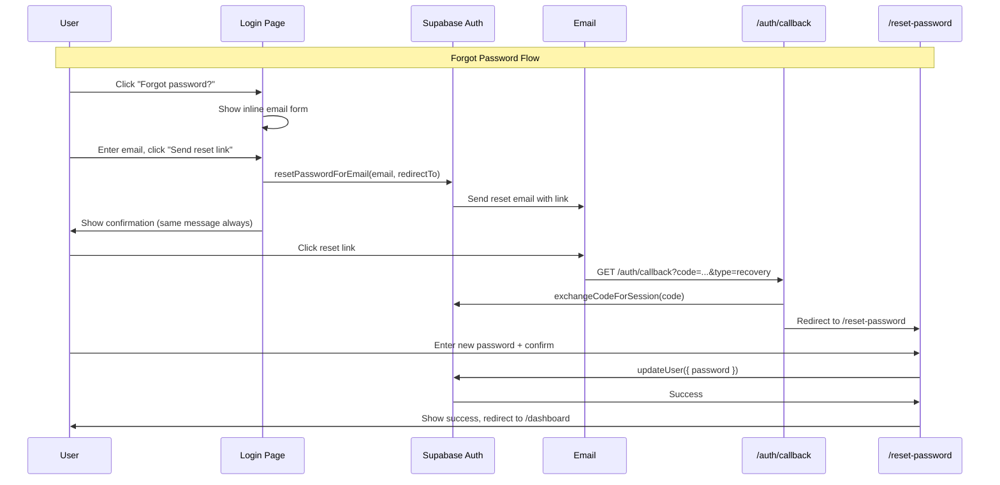

# Design Document

## Overview

This design covers two related changes to Home OS authentication:

1. **Forgot Password Flow** — A complete password recovery flow using Supabase's built-in `resetPasswordForEmail` and `updateUser` APIs. Users initiate recovery from the login page, receive an email with a reset link, and set a new password on a dedicated page.

2. **Remove GitHub OAuth** — Simplify the login experience by removing GitHub as an OAuth provider, leaving Google OAuth and email/password as the only sign-in methods.

Both changes are scoped to the client-side auth UI, the auth callback route handler, and the OAuth provider configuration. No database schema changes are required — Supabase Auth handles password reset tokens internally.

### Design Decisions

| Decision | Rationale |
|----------|-----------|
| Inline forgot-password form (not a separate page) | Keeps the flow lightweight and avoids an extra route for a single input field. Matches the calm, minimal aesthetic. |
| Dedicated `/reset-password` page for setting new password | The user arrives via email link with a recovery token — a focused page avoids confusion with the login form. |
| Anti-enumeration: same success message for all emails | Security best practice — prevents attackers from discovering which emails are registered. |
| Client-side validation before Supabase calls | Reduces unnecessary network requests and provides instant feedback. |
| No migration needed for GitHub removal | Existing GitHub-authenticated users retain their data. They simply can no longer sign in via GitHub (they can use email/password or link a Google account via Supabase dashboard). |

## Architecture



### Route Structure

| Route | Type | Purpose |
|-------|------|---------|
| `/login` | Client page | Login + forgot password inline form |
| `/auth/callback` | Route handler | Exchanges code for session, routes recovery to `/reset-password` |
| `/reset-password` | Client page | New password form (accessible only with recovery session) |

### Middleware Behavior

- `/reset-password` is **NOT** added to `protectedRoutes` — it must be accessible via the recovery token flow.
- The page itself checks for an active session on mount: if no session exists, redirect to `/login`; if a normal (non-recovery) session exists, redirect to `/dashboard`.

## Components and Interfaces

### Modified Components

#### `lib/auth/oauth-providers.ts`
Remove the GitHub entry from `OAUTH_PROVIDERS`. The array will contain only the Google provider.

```typescript
export const OAUTH_PROVIDERS: OAuthProviderConfig[] = [
  { id: "google", name: "Google", icon: GoogleIcon, label: "Continue with Google" },
];
```

#### `app/auth/callback/route.ts`
Add handling for `type=recovery` query parameter:
- If `type=recovery` and code exchange succeeds → redirect to `/reset-password`
- If `type=recovery` and code exchange fails → redirect to `/login` with expired link error

#### `app/login/page.tsx`
Add a `forgotPassword` state that toggles between the standard login form and the inline forgot-password form. The forgot-password form contains:
- Email input (`input-app`, maxLength 254)
- "Send reset link" button (`btn-primary-app`)
- "Back to login" link
- Client-side email validation
- Loading/disabled state during submission
- Confirmation message on success (anti-enumeration: same message regardless of email existence)

### New Components

#### `app/reset-password/page.tsx`
A `"use client"` page component with:
- Session check on mount (redirect if no session or non-recovery session)
- Two password inputs: "New password" and "Confirm password"
- Client-side validation (match, min 6, max 128)
- Calls `supabase.auth.updateUser({ password })` on submit
- Success toast + redirect to `/dashboard` after 2 seconds
- Error handling for expired tokens and network failures

### Validation Logic

#### Email Validation (forgot password form)

```typescript
type ValidationResult = { valid: boolean; error?: string };

function validateEmail(email: string): ValidationResult {
  if (!email.trim()) return { valid: false, error: "Email address is required" };
  if (email.length > 254) return { valid: false, error: "Email is too long" };
  const emailRegex = /^[^\s@]+@[^\s@]+\.[^\s@]+$/;
  if (!emailRegex.test(email)) return { valid: false, error: "Please enter a valid email address" };
  return { valid: true };
}
```

#### Password Validation (reset password page)

```typescript
type PasswordValidationResult = { valid: boolean; error?: string };

function validatePasswords(password: string, confirm: string): PasswordValidationResult {
  if (password.length < 6) return { valid: false, error: "Password must be at least 6 characters" };
  if (password.length > 128) return { valid: false, error: "Password must not exceed 128 characters" };
  if (password !== confirm) return { valid: false, error: "Passwords do not match" };
  return { valid: true };
}
```

## Data Models

No new database tables or migrations are required. The feature relies entirely on Supabase Auth's built-in password reset mechanism:

- **Reset tokens** are managed internally by Supabase Auth (stored in `auth.flow_state` and `auth.mfa_factors` tables managed by Supabase).
- **User passwords** are stored in Supabase's `auth.users` table (hashed, never exposed to the application).
- **Existing user data** (profiles, notes, tasks, books, contacts) is unaffected by the GitHub OAuth removal — no rows are deleted or modified.

### Supabase Auth API Surface Used

| Method | Purpose |
|--------|---------|
| `supabase.auth.resetPasswordForEmail(email, { redirectTo })` | Triggers password reset email |
| `supabase.auth.exchangeCodeForSession(code)` | Exchanges callback code for session (recovery or OAuth) |
| `supabase.auth.updateUser({ password })` | Sets new password for authenticated user |
| `supabase.auth.getUser()` | Validates session on reset-password page |

## Correctness Properties

*A property is a characteristic or behavior that should hold true across all valid executions of a system — essentially, a formal statement about what the system should do. Properties serve as the bridge between human-readable specifications and machine-verifiable correctness guarantees.*

### Property 1: Invalid email rejection

*For any* string that is empty, composed entirely of whitespace, missing an `@` symbol, missing a domain after `@`, or exceeds 254 characters, the `validateEmail` function SHALL return `{ valid: false }` with an appropriate error message, and no network request SHALL be initiated.

**Validates: Requirements 1.5, 2.4, 2.5, 2.8**

### Property 2: Anti-enumeration response consistency

*For any* valid email address submitted to the forgot password form, regardless of whether that email exists in the system or whether Supabase returns success or a "user not found" style error, the UI SHALL display the same confirmation message text.

**Validates: Requirements 2.6**

### Property 3: Password mismatch detection

*For any* two distinct non-empty strings of valid length (6–128 characters), the `validatePasswords` function SHALL return `{ valid: false, error: "Passwords do not match" }`.

**Validates: Requirements 3.4**

### Property 4: Password length boundary validation

*For any* string shorter than 6 characters, the `validatePasswords` function SHALL return an error indicating the minimum length requirement. *For any* string longer than 128 characters, the `validatePasswords` function SHALL return an error indicating the maximum length requirement.

**Validates: Requirements 3.5, 3.6**

## Error Handling

| Scenario | Handling |
|----------|----------|
| Network error during `resetPasswordForEmail` | Show error toast: "Could not send reset link. Please try again." Re-enable submit button. |
| Network error during `updateUser` | Show error toast: "Could not update password. Please try again." Re-enable submit button. |
| Expired/invalid recovery token (code exchange fails) | Redirect to `/login` with error: "Reset link has expired. Please request a new one." |
| Expired token during `updateUser` | Show error message on page with link back to forgot password form. |
| No session on `/reset-password` | Redirect to `/login`. |
| Normal (non-recovery) session on `/reset-password` | Redirect to `/dashboard`. |
| Unrecognized OAuth provider callback | Redirect to `/login` with generic auth error. |

### Error Message Security

- Never expose whether an email exists in the system (anti-enumeration).
- Never expose internal error details, stack traces, or Supabase error codes to the user.
- Use the existing `sanitizeErrorMessage` utility from the login page for any error messages passed via URL parameters.

## Testing Strategy

### Property-Based Tests (fast-check)

The project will use **fast-check** as the property-based testing library (TypeScript, well-maintained, integrates with Vitest).

Each property test runs a minimum of **100 iterations** with randomly generated inputs.

| Property | Test File | What It Validates |
|----------|-----------|-------------------|
| Property 1: Invalid email rejection | `__tests__/auth/email-validation.property.test.ts` | `validateEmail` rejects all invalid formats |
| Property 2: Anti-enumeration response | `__tests__/auth/anti-enumeration.property.test.ts` | Same UI message for existing and non-existing emails |
| Property 3: Password mismatch detection | `__tests__/auth/password-validation.property.test.ts` | `validatePasswords` catches all mismatches |
| Property 4: Password length boundaries | `__tests__/auth/password-validation.property.test.ts` | `validatePasswords` enforces 6–128 char range |

Tag format: `// Feature: forgot-password-and-disable-github-oauth, Property N: <property text>`

### Unit Tests (example-based)

| Test | What It Validates |
|------|-------------------|
| Login page renders forgot password link | Req 1.1 |
| Forgot password form toggle works | Req 1.2, 1.4 |
| Accessibility attributes on forgot password link | Req 1.3 |
| Loading state during reset email submission | Req 2.3 |
| Reset password page renders correct fields | Req 3.1 |
| Success redirect after password update | Req 3.3 |
| Expired token error shows link to forgot password | Req 3.7 |
| OAuth providers array contains only Google | Req 5.1 |
| Login page renders only Google OAuth button | Req 5.2, 5.3 |
| Auth callback routes recovery type to /reset-password | Req 4.3 |
| Auth callback handles failed recovery code exchange | Req 4.4 |
| CSS classes match design system requirements | Req 6.1–6.6 |

### Integration Tests

| Test | What It Validates |
|------|-------------------|
| Full forgot password flow (mock Supabase) | End-to-end flow from link click to confirmation |
| Full reset password flow (mock Supabase) | End-to-end flow from page load to dashboard redirect |
| Auth callback with type=recovery | Correct routing through callback handler |

### Test Configuration

- **Runner**: Vitest (to be configured if not already present)
- **PBT Library**: fast-check (minimum 100 iterations per property)
- **Component Testing**: React Testing Library + jsdom
- **Mocking**: Vitest mocks for Supabase client methods
