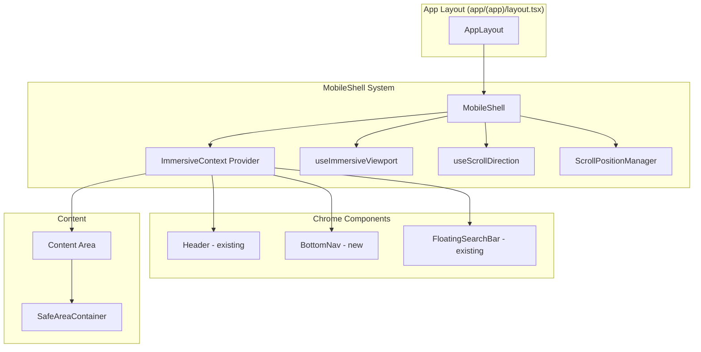
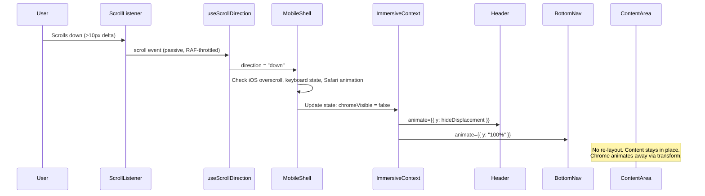

# Design Document: Immersive Mobile UX

## Overview

This feature introduces a comprehensive immersive mobile experience for Home OS that mimics the edge-to-edge, infinite-scroll feel of native mobile apps (YouTube, TikTok, Instagram). It builds on the existing scroll-hide header, Dynamic Island safe-area handling, and floating search bar implementations.

The system is composed of:
- **MobileShell**: A layout orchestrator that wraps mobile content and coordinates chrome visibility, viewport state, and scroll behavior
- **SafeAreaContainer**: A reusable abstraction over CSS `env(safe-area-inset-*)` values
- **BottomNav**: A fixed bottom navigation bar with scroll-hide behavior
- **useImmersiveViewport**: A hook providing dynamic viewport dimensions, keyboard state, PWA detection, and orientation

The design prioritizes:
1. **Zero content displacement** during chrome transitions (transform-only animations)
2. **Performance** via GPU-accelerated transforms, `will-change` lifecycle management, and graceful degradation
3. **Platform correctness** handling iOS Safari quirks, PWA standalone mode, and keyboard interactions
4. **Accessibility** with proper ARIA attributes, reduced motion support, and focus preservation

## Architecture

### High-Level Component Diagram



### Data Flow Diagram



### State Machine

```mermaid
stateDiagram-v2
    [*] --> ChromeVisible: Mount (initial state)
    ChromeVisible --> ChromeHidden: scrollDirection === "down"
    ChromeHidden --> ChromeVisible: scrollDirection === "up" || scrollY === 0
    ChromeVisible --> KeyboardOpen: isKeyboardOpen === true
    ChromeHidden --> KeyboardOpen: isKeyboardOpen === true
    KeyboardOpen --> ChromeVisible: keyboard closes + scrollDir !== "down"
    KeyboardOpen --> ChromeHidden: keyboard closes + scrollDir === "down"
    
    note right of KeyboardOpen: BottomNav hidden (instant)<br/>Scroll-direction changes suppressed
    note right of ChromeHidden: pointer-events: none on chrome<br/>will-change: transform active
```

## Components and Interfaces

### 1. MobileShell Component

**File:** `components/layout/mobile-shell.tsx`

```typescript
"use client"

type ImmersiveState = "chrome-visible" | "chrome-hidden" | "keyboard-open"

type ImmersiveContextValue = {
  state: ImmersiveState
  isStandalone: boolean
  viewportHeight: number
  orientation: "portrait" | "landscape"
  chromeVisible: boolean
}

type MobileShellProps = {
  children: React.ReactNode
}

export function MobileShell({ children }: MobileShellProps): JSX.Element
```

**Responsibilities:**
- Wraps content in a `100dvh` container on mobile (< 768px)
- Provides `ImmersiveContext` to descendants
- Orchestrates chrome visibility based on scroll direction
- Manages `--app-viewport-height` CSS custom property on `document.documentElement`
- Handles iOS Safari overscroll bounce suppression (ignores scrollY < 0 or > max)
- Suppresses chrome changes during Safari toolbar animation (300ms window)
- Manages scroll position preservation across routes (LRU cache, max 20)
- Passes through to desktop layout when viewport ≥ 768px

**Integration point:** Replaces the inner `<div className="flex-1 bg-app">` in `app/(app)/layout.tsx` on mobile.

### 2. SafeAreaContainer Component

**File:** `components/layout/safe-area-container.tsx`

```typescript
type SafeAreaEdge = "top" | "bottom" | "left" | "right"

type SafeAreaContainerProps = {
  edges?: SafeAreaEdge[]
  as?: React.ElementType
  className?: string
  children?: React.ReactNode
}

export function SafeAreaContainer({
  edges,
  as = "div",
  className,
  children,
}: SafeAreaContainerProps): JSX.Element
```

**Behavior:**
- When `edges` is undefined → applies all four insets
- When `edges` is `[]` → applies no insets
- When `edges` contains specific values → applies only those insets
- Renders as the element specified by `as` prop (default: `div`)
- Appends `className` after safe-area styles

### 3. BottomNav Component

**File:** `components/layout/bottom-nav.tsx`

```typescript
type NavItem = {
  href: string
  label: string
  icon: React.ComponentType<{ className?: string }>
  ariaLabel: string
}

type BottomNavProps = {
  items: NavItem[]
}

export function BottomNav({ items }: BottomNavProps): JSX.Element | null
```

**Behavior:**
- Renders only on mobile (< 768px), returns `null` on desktop
- Fixed position at bottom with `env(safe-area-inset-bottom)` padding
- Hides via `translateY(100%)` on scroll down, reveals via `translateY(0)` on scroll up
- Uses Framer Motion `animate` prop for GPU-accelerated transforms
- Sets `pointer-events: none` when hidden, `aria-hidden="true"` when off-screen
- Maximum 5 navigation items, minimum 44x44px touch targets
- Respects reduced motion and low-performance preferences (duration: 0)
- Always visible when `scrollY === 0`
- Instantly hidden (duration: 0) when keyboard is open

### 4. useImmersiveViewport Hook

**File:** `hooks/use-immersive-viewport.ts`

```typescript
type ImmersiveViewportState = {
  viewportHeight: number
  isKeyboardOpen: boolean
  isStandalone: boolean
  orientation: "portrait" | "landscape"
}

export function useImmersiveViewport(): ImmersiveViewportState
```

**Behavior:**
- Returns current visual viewport height (via `window.visualViewport.height` or `window.innerHeight` fallback)
- `isKeyboardOpen`: true when visual viewport is ≥ 150px smaller than layout viewport
- `isStandalone`: true when `display-mode: standalone` matches or `navigator.standalone` is true
- `orientation`: "portrait" or "landscape" from screen orientation or matchMedia
- Throttles resize callbacks via `requestAnimationFrame` (one update per frame)
- Debounces orientation change by 100ms
- Uses passive event listeners
- Cleans up all listeners on unmount
- Returns safe defaults during SSR (`{ viewportHeight: 0, isKeyboardOpen: false, isStandalone: false, orientation: "portrait" }`)
- Synchronously measures on mount before events fire

### 5. ScrollPositionManager (internal)

**File:** Internal to `components/layout/mobile-shell.tsx`

```typescript
type ScrollCache = Map<string, { offset: number; timestamp: number }>

// LRU cache with max 20 entries
// Key: pathname (excluding query params and hash)
// Value: vertical scroll offset in pixels
```

**Behavior:**
- Stores scroll position on route exit (client-side navigation)
- Restores scroll position on route enter (after content mounts and is tall enough)
- Evicts least-recently-used entry when cache exceeds 20
- Clears on hard refresh / full page reload
- Falls back to scroll position 0 for new routes
- Caps restored position at max scrollable height

## Data Models

### ImmersiveContext State

```typescript
type ImmersiveState = "chrome-visible" | "chrome-hidden" | "keyboard-open"

type ImmersiveContextValue = {
  /** Current immersive state machine position */
  state: ImmersiveState
  /** Whether app is running as installed PWA */
  isStandalone: boolean
  /** Current visual viewport height in pixels */
  viewportHeight: number
  /** Current device orientation */
  orientation: "portrait" | "landscape"
  /** Convenience: true when state is "chrome-visible" */
  chromeVisible: boolean
}
```

### BottomNav Item Model

```typescript
type NavItem = {
  /** Route path for navigation */
  href: string
  /** Display label for the nav item */
  label: string
  /** Icon component (Lucide or Phosphor) */
  icon: React.ComponentType<{ className?: string }>
  /** Accessible label for screen readers (e.g., "Navigate to Dashboard") */
  ariaLabel: string
}
```

### Scroll Position Cache Entry

```typescript
type ScrollCacheEntry = {
  /** Vertical scroll offset in pixels */
  offset: number
  /** Timestamp of last access (for LRU eviction) */
  timestamp: number
}
```

### CSS Custom Properties Contract

| Property | Set by | Consumed by | Description |
|----------|--------|-------------|-------------|
| `--app-viewport-height` | MobileShell | Content area, any component needing viewport height | Current visual viewport height in px |
| `--header-hide-y` | CSS (globals.css) | Header | Negative translateY for header hide (existing) |
| `--bottom-nav-height` | BottomNav | MobileShell, content area | Height of bottom nav including safe-area padding |

### Animation Configuration

| Animation | Duration | Easing | Property |
|-----------|----------|--------|----------|
| Chrome hide | 200ms | ease-in (`EASING.exit`) | `transform: translateY` |
| Chrome show | 200ms | ease-out (`EASING.entrance`) | `transform: translateY` |
| Keyboard hide (BottomNav) | 0ms | instant | `transform: translateY` |
| Reduced motion / low-perf | 0ms | instant | `transform: translateY` |


## Correctness Properties

*A property is a characteristic or behavior that should hold true across all valid executions of a system—essentially, a formal statement about what the system should do. Properties serve as the bridge between human-readable specifications and machine-verifiable correctness guarantees.*

### Property 1: SafeAreaContainer edge-to-padding mapping

*For any* subset of edges from the set `["top", "bottom", "left", "right"]` (including undefined meaning all, and empty array meaning none), the SafeAreaContainer SHALL apply exactly the corresponding `env(safe-area-inset-*)` padding values for the specified edges and no others.

**Validates: Requirements 2.1, 2.2, 2.3, 2.4, 2.5, 2.6**

### Property 2: Chrome visibility state machine

*For any* sequence of scroll direction values (`"up"`, `"down"`, or `null`), the MobileShell chrome visibility state SHALL be "hidden" when the most recent direction is `"down"` and "visible" when the most recent direction is `"up"` or `null`, provided the keyboard is not open and scrollY is not at overscroll bounds.

**Validates: Requirements 1.5, 3.3, 3.4, 3.11**

### Property 3: Chrome visibility determines pointer-events and aria-hidden

*For any* chrome visibility state, when chrome is hidden the BottomNav SHALL have `pointer-events: none` and `aria-hidden="true"`, and when chrome is visible the BottomNav SHALL have `pointer-events: auto` and `aria-hidden="false"`.

**Validates: Requirements 3.6, 14.2, 14.3**

### Property 4: Reduced motion and low-performance disable animations

*For any* chrome state transition, when the user prefers reduced motion OR the device is detected as low-performance, all animation durations SHALL be 0ms while state changes and pointer-events toggling are maintained.

**Validates: Requirements 3.9, 3.10, 13.4, 14.5**

### Property 5: Zero content displacement during chrome transitions

*For any* scroll position and any chrome visibility transition (hide or show), the content area's scroll position SHALL remain unchanged with zero pixels of displacement.

**Validates: Requirements 12.4, 12.5, 12.7**

### Property 6: Only transform and opacity are animated

*For any* animation configuration in the MobileShell chrome visibility system, only `transform` and `opacity` CSS properties SHALL be animated. No layout-triggering properties (width, height, top, bottom, left, right, margin, padding) SHALL be animated.

**Validates: Requirements 13.1, 13.2**

### Property 7: Animation duration within bounds

*For any* chrome hide/show animation (excluding reduced motion and low-performance modes), the duration SHALL be between 150ms and 300ms inclusive, with ease-in easing for hide and ease-out easing for show.

**Validates: Requirements 3.5, 13.3**

### Property 8: Keyboard detection threshold

*For any* pair of visual viewport height and layout viewport height values, `isKeyboardOpen` SHALL be `true` if and only if the layout viewport height minus the visual viewport height is greater than or equal to 150px.

**Validates: Requirements 4.2, 7.5**

### Property 9: Scroll position store-restore round trip

*For any* route pathname and scroll offset, storing the scroll position on route exit and then navigating back to that route SHALL restore the same scroll offset (capped at the maximum scrollable height of the content).

**Validates: Requirements 6.1, 6.2**

### Property 10: Scroll cache LRU eviction

*For any* sequence of route visits, the scroll position cache SHALL never exceed 20 entries, and when a 21st entry is added, the least recently accessed entry SHALL be evicted.

**Validates: Requirements 6.3**

### Property 11: Scroll position capped at content height

*For any* stored scroll position that exceeds the current content's scrollable height, the restored scroll position SHALL equal the maximum available scroll position (`scrollHeight - clientHeight`) rather than the stored value.

**Validates: Requirements 6.5**

### Property 12: CSS custom property tracks visual viewport

*For any* visual viewport height change (including keyboard open/close), the `--app-viewport-height` CSS custom property on `document.documentElement` SHALL equal the current `window.visualViewport.height` (or `window.innerHeight` as fallback), updated at most once per animation frame.

**Validates: Requirements 5.2, 7.2, 7.4**

### Property 13: iOS overscroll bounce suppression

*For any* scroll event where `window.scrollY < 0` or `window.scrollY > (document.documentElement.scrollHeight - window.innerHeight)`, the MobileShell SHALL NOT trigger a chrome visibility state change.

**Validates: Requirements 8.1**

### Property 14: Orientation change preserves chrome state

*For any* chrome visibility state (visible or hidden) at the time of an orientation change event, the chrome visibility state SHALL remain unchanged after the orientation change completes.

**Validates: Requirements 10.2**

### Property 15: Keyboard open suppresses scroll-direction chrome changes

*For any* scroll direction change that occurs while `isKeyboardOpen` is true, the MobileShell SHALL NOT update chrome visibility state.

**Validates: Requirements 7.6**

### Property 16: BottomNav touch targets minimum size

*For any* navigation item rendered in the BottomNav, the touch target area SHALL be at least 44px × 44px.

**Validates: Requirements 3.8**

### Property 17: BottomNav items have descriptive aria-labels

*For any* navigation item rendered in the BottomNav, the element SHALL have a non-empty `aria-label` attribute that describes the navigation destination.

**Validates: Requirements 14.6**

### Property 18: No animation debt from rapid direction changes

*For any* sequence of rapid scroll direction changes, the MobileShell SHALL maintain at most one pending `animate` prop value at any time — each new direction results in a single Framer Motion animate update that starts from the current rendered position.

**Validates: Requirements 11.3, 11.4**

## Error Handling

### Graceful Degradation

| Scenario | Behavior |
|----------|----------|
| Visual Viewport API unavailable | Fall back to `window.innerHeight` for viewport height; keyboard detection disabled |
| `dvh` CSS unit unsupported | Fall back to `--app-viewport-height` custom property, then `100vh` |
| `navigator.standalone` unsupported | Rely solely on `display-mode: standalone` media query |
| `window` undefined (SSR) | Return safe defaults, register no listeners |
| Children prop is null/undefined | Render empty container at full viewport height |
| Scroll position exceeds content height | Cap at maximum scrollable position |
| Orientation API unavailable | Fall back to `matchMedia("(orientation: portrait)")` |

### Edge Cases

| Edge Case | Handling |
|-----------|----------|
| iOS overscroll bounce (scrollY < 0) | Suppress scroll direction changes |
| Safari toolbar animation (rapid viewport resizes) | 300ms suppression window for chrome changes |
| Keyboard opens during scroll-hide animation | Immediately hide BottomNav (duration: 0), suppress further scroll-based changes |
| Orientation change while keyboard is open | Close keyboard state first, then apply orientation adjustments |
| Route content shorter than stored scroll position | Scroll to max available position |
| Hard refresh / full page reload | Clear all scroll position cache |
| Rapid direction reversals mid-animation | Framer Motion interrupts from current position (no queue) |

### Error Boundaries

The MobileShell should not throw errors that break the page. If any viewport measurement fails:
- Log a warning to console in development
- Fall back to safe defaults (100vh, no keyboard detection, portrait orientation)
- Continue rendering children normally

## Testing Strategy

### Property-Based Tests (fast-check)

Property-based testing is appropriate for this feature because:
- The state machine has clear universal properties (scroll direction → visibility)
- Edge-to-padding mapping has a well-defined input space (subsets of 4 edges)
- Keyboard detection has a clear threshold property over continuous input
- Scroll cache has invariants (max size, LRU eviction) testable over random sequences
- Animation configs have bounded constraints testable over all configs

**Library:** fast-check (already in project)
**Minimum iterations:** 100 per property
**Tag format:** `Feature: immersive-mobile-ux, Property {N}: {title}`

Each correctness property (1–18) maps to a property-based test. Tests should:
- Generate random inputs using fast-check arbitraries
- Exercise the function/hook/component under test
- Assert the universal property holds

### Unit Tests (example-based)

| Test | Validates |
|------|-----------|
| MobileShell renders 100dvh container on mobile | Req 1.1 |
| MobileShell passes through on desktop (≥ 768px) | Req 1.3 |
| MobileShell initial context state is "chrome-visible" | Req 1.4 |
| SafeAreaContainer renders as specified element | Req 2.8 |
| SafeAreaContainer renders children | Req 2.9 |
| BottomNav returns null on desktop | Req 3.7 |
| useImmersiveViewport returns correct initial values | Req 4.11 |
| useImmersiveViewport cleans up listeners on unmount | Req 4.7 |
| useImmersiveViewport uses passive listeners | Req 4.8 |
| PWA standalone detection methods | Req 9.4 |
| will-change lifecycle (applied during transition, removed after 500ms) | Req 13.5, 13.6 |
| BottomNav role="navigation" and aria-label | Req 14.1 |
| Focus management preserved during chrome toggle | Req 14.4 |

### Integration Tests

| Test | Validates |
|------|-----------|
| Full scroll-hide flow: scroll down → chrome hides → scroll up → chrome shows | Req 1.5, 3.3, 3.4 |
| Keyboard open → BottomNav hides → keyboard close → BottomNav restores | Req 7.1, 7.3 |
| Route navigation → scroll stored → navigate back → scroll restored | Req 6.1, 6.2 |
| Orientation change → viewport updates → chrome state preserved | Req 10.1, 10.2 |
| Safari toolbar animation suppression (300ms window) | Req 8.3 |

### Test File Structure

```
__tests__/immersive-mobile-ux/
  safe-area-edge-mapping.property.test.ts
  chrome-visibility-state-machine.property.test.ts
  chrome-pointer-events-aria.property.test.ts
  reduced-motion-zero-duration.property.test.ts
  content-displacement.property.test.ts
  animation-properties-constraint.property.test.ts
  animation-duration-bounds.property.test.ts
  keyboard-detection-threshold.property.test.ts
  scroll-position-roundtrip.property.test.ts
  scroll-cache-lru.property.test.ts
  scroll-position-cap.property.test.ts
  viewport-height-tracking.property.test.ts
  ios-overscroll-suppression.property.test.ts
  orientation-preserves-chrome.property.test.ts
  keyboard-suppresses-scroll-chrome.property.test.ts
  touch-targets-minimum.property.test.ts
  nav-items-aria-labels.property.test.ts
  no-animation-debt.property.test.ts
```
