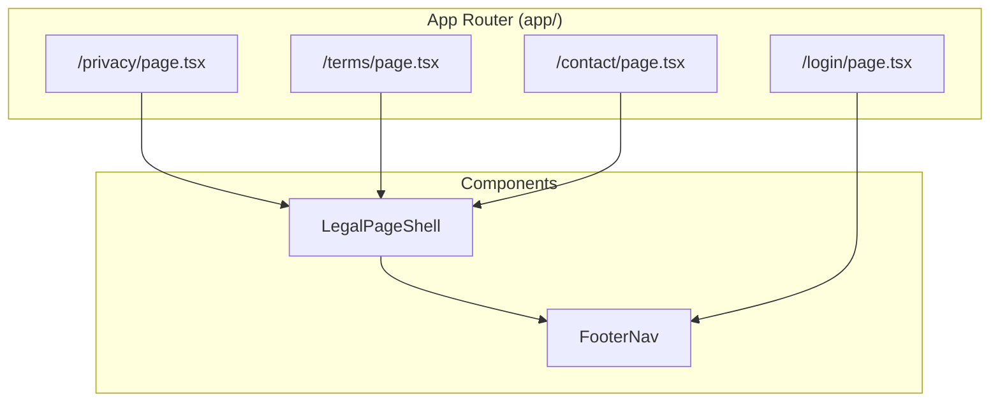

# Design Document: Legal Pages

## Overview

This design adds three static, publicly accessible pages to Home OS — Privacy Policy (`/privacy`), Terms of Service (`/terms`), and Contact Us (`/contact`) — along with a shared page shell layout and a footer navigation component. These pages are Server Components that render static content without authentication, using the app's existing design tokens and semantic CSS classes.

The key architectural decision is to use a **dedicated layout** for the legal pages that bypasses the main app shell (sidebar, header, command menu) and instead renders a minimal page shell with a brand link header and footer navigation. This keeps the legal pages lightweight and accessible to unauthenticated visitors while maintaining visual consistency with the app's calm, minimal aesthetic.

### Research Findings

- **Next.js 16 App Router**: Each route folder gets its own `page.tsx`. A shared `layout.tsx` in a parent or route group folder wraps child pages. No route groups needed here since `/privacy`, `/terms`, and `/contact` are top-level routes — a `(legal)` route group would work but adds unnecessary nesting. Instead, each page imports a shared `LegalPageShell` component.
- **Middleware**: The existing middleware only matches explicitly listed protected routes. Since `/privacy`, `/terms`, and `/contact` are not in the `matcher` config, the middleware won't run for these routes at all — no changes needed.
- **Existing patterns**: The app already has a `PageShell` component in `components/layout/page-shell.tsx` for authenticated pages. The legal pages need a different shell (no sidebar/header, narrower max-width, brand link + footer nav).

## Architecture



### Routing Strategy

Each legal page is a standalone Server Component at the top level of `app/`:
- `app/privacy/page.tsx` → renders Privacy Policy
- `app/terms/page.tsx` → renders Terms of Service
- `app/contact/page.tsx` → renders Contact Us

These pages import and use `LegalPageShell` as a wrapper component (not a Next.js layout file) because:
1. They don't share state or need layout persistence across navigation
2. The root `app/layout.tsx` already provides `<html>`, `<body>`, theme script, and providers
3. A wrapper component is simpler than a route group with a nested layout for three independent pages

### Middleware Behavior

The existing middleware's `matcher` config does not include `/privacy`, `/terms`, or `/contact`. This means the middleware function never executes for these routes — they are inherently public. No code changes to middleware are required.

## Components and Interfaces

### LegalPageShell

A Server Component that wraps legal page content with a consistent header (brand link) and footer (navigation links).

```typescript
// components/legal/legal-page-shell.tsx

type LegalPageShellProps = {
  children: React.ReactNode;
};

export function LegalPageShell({ children }: LegalPageShellProps) {
  // Renders:
  // - <div> full-height wrapper with bg-app
  //   - <header> with "Home OS" brand link → /
  //   - <main> with max-w-3xl, px-6, py-10 content area
  //     - <article> with space-y-8 section spacing
  //       - {children}
  //   - <FooterNav />
}
```

**Design decisions:**
- Uses `<main>` and `<article>` for semantic HTML
- `max-w-3xl` (narrower than the app's `max-w-6xl`) for comfortable reading width on legal text
- Brand link uses an `<a>` element with `aria-label="Navigate to Home OS home page"` and visible focus ring
- Responsive: reduces to `px-4` on mobile via Tailwind responsive classes

### FooterNav

A reusable navigation component rendered at the bottom of legal pages and the login page.

```typescript
// components/legal/footer-nav.tsx

export function FooterNav() {
  // Renders:
  // - <nav aria-label="Footer">
  //   - Flex container with gap, centered
  //   - Links: "Privacy Policy" → /privacy, "Terms of Service" → /terms, "Contact" → /contact
  //   - Each link uses `link-muted` class
  //   - Touch targets: min-h-[44px] min-w-[44px] with flex items-center
}
```

**Design decisions:**
- Uses Next.js `<Link>` for client-side navigation and prefetching
- `link-muted` class provides the muted color with hover-to-primary transition
- `aria-label="Footer"` on the `<nav>` element for accessibility
- Padding on links ensures 44×44px touch targets on mobile

### Page Components

Each page is a Server Component that composes `LegalPageShell` with static content:

```typescript
// app/privacy/page.tsx
export default function PrivacyPage() {
  return (
    <LegalPageShell>
      <h1>Privacy Policy</h1>
      <p className="text-app-muted">Last updated: January 1, 2025</p>
      <section>...</section>
      {/* Sections: Data We Collect, How We Use Your Data, etc. */}
    </LegalPageShell>
  );
}
```

```typescript
// app/terms/page.tsx
export default function TermsPage() { /* similar structure */ }
```

```typescript
// app/contact/page.tsx
export default function ContactPage() { /* similar structure */ }
```

### Integration with Login Page

The `FooterNav` component is imported into the existing login page (`app/login/page.tsx`) and rendered below the login form panel.

## Data Models

This feature has no data models. All content is static and hardcoded in the page components. There are no database tables, API calls, or dynamic data fetching involved.

### Static Content Structure

Each page's content follows this logical structure:

```typescript
type LegalSection = {
  heading: string;      // h2 section heading
  paragraphs: string[]; // body text paragraphs
  list?: string[];      // optional bullet list items
};

type LegalPageContent = {
  title: string;           // h1 page title
  lastUpdated: string;     // human-readable date string
  sections: LegalSection[];
};
```

This is not a runtime type — it describes the shape of the static JSX content for documentation purposes.

## Error Handling

This feature has minimal error surface since all content is static and rendered at build time:

| Scenario | Handling |
|----------|----------|
| Invalid route (e.g., `/privacy/foo`) | Next.js default 404 page — no custom handling needed |
| Theme not loaded | CSS variables fall back to `:root` defaults; pages remain readable |
| JavaScript disabled | Pages are Server Components rendering static HTML — fully functional without JS |
| Broken navigation link | Standard `<Link>` behavior; if route doesn't exist, Next.js 404 handles it |

No error boundaries are needed for these pages since they contain no dynamic data fetching, no client-side state, and no async operations.

## Testing Strategy

### Why Property-Based Testing Does Not Apply

This feature consists entirely of static UI rendering — Server Components that output fixed HTML content with no dynamic inputs, data transformations, or business logic. There are no pure functions whose behavior varies with input, no serialization/parsing, and no algorithms to validate. The acceptance criteria describe UI structure and content presence, which are best verified with example-based tests.

### Recommended Testing Approach

**Unit/Integration Tests (example-based):**

1. **Component rendering tests** — Verify each page renders expected headings, sections, and content using React Testing Library:
   - Privacy page renders all required section headings ("Data We Collect", "How We Use Your Data", etc.)
   - Terms page renders all required section headings
   - Contact page renders email link, response time, and inquiry types
   - Each page renders the "last updated" date

2. **LegalPageShell tests** — Verify the shell renders:
   - Brand link with correct href (`/`) and aria-label
   - `<main>` element with correct classes
   - `<article>` wrapper for content
   - FooterNav component

3. **FooterNav tests** — Verify:
   - Renders `<nav>` with `aria-label="Footer"`
   - Contains three links with correct labels and hrefs
   - Links use `link-muted` class

4. **Accessibility tests** — Verify:
   - Semantic HTML structure (main, article, section, nav, h1, h2)
   - All interactive elements have accessible names
   - Focus indicators are visible (via existing CSS)

5. **Middleware non-interference** — Verify:
   - `/privacy`, `/terms`, `/contact` are NOT in the middleware matcher
   - Unauthenticated requests to these routes do not redirect

**Snapshot tests:**
- Capture rendered HTML of each page to detect unintended changes to structure or content

**Manual verification:**
- Dark mode appearance
- Mobile responsiveness (viewport < 768px)
- Touch target sizes on mobile devices

