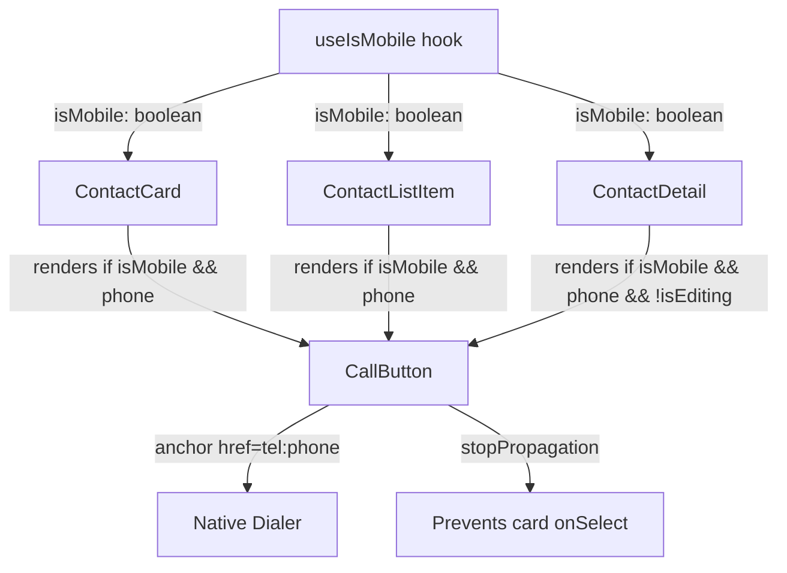

# Design Document: Mobile Contact Call

## Overview

This feature adds a tap-to-call button to contact cards, contact list items, and the contact detail sheet when viewed on mobile viewports. The button renders as an anchor element (`<a href="tel:...">`) that initiates a native phone call via the device's dialer. It is conditionally rendered based on two criteria: the viewport must be mobile (< 768px) and the contact must have a non-null `phone` field.

The implementation is purely client-side UI — no new API routes, database changes, or server logic are required. The feature integrates into three existing components (`ContactCard`, `ContactListItem`, `ContactDetail`) by adding a shared `CallButton` component.

## Architecture



### Design Decisions

1. **Shared `CallButton` component** — A single reusable component handles rendering, accessibility, event isolation, and styling. This avoids duplicating logic across three host components.

2. **Anchor element over button** — Using `<a href="tel:...">` is semantically correct for navigation to a URI scheme and provides native browser/OS integration without JavaScript handlers for the call action itself.

3. **Conditional rendering over CSS hiding** — The button is not rendered at all on desktop (rather than hidden via CSS) to keep the DOM clean and avoid assistive technology announcing elements that aren't actionable.

4. **`stopPropagation` for event isolation** — Consistent with the existing pattern used by follow-up, favorite, and delete buttons in the same components.

## Components and Interfaces

### CallButton (new shared component)

**Location:** `components/contacts/call-button.tsx`

```typescript
type CallButtonProps = {
  phone: string
  contactName: string
}
```

**Responsibilities:**
- Renders an `<a>` element with `href="tel:{phone}"`
- Applies `aria-label="Call {name}"` (truncated to 100 chars with ellipsis)
- Calls `stopPropagation()` on click and keyboard events (Enter/Space)
- Applies 44×44px minimum touch target
- Renders the `Phone` icon from Lucide React
- Applies hover/focus styles per design system

**Rendering logic:**
- The host component is responsible for checking `isMobile && contact.phone` before rendering `CallButton`
- `CallButton` itself assumes it should render (no internal conditional logic)

### Modified Components

#### ContactCard (contacts-view.tsx)

- Imports `useIsMobile` and `CallButton`
- Adds `CallButton` to the action buttons row (top-right, alongside follow-up and favorite)
- Condition: `isMobile && contact.phone`

#### ContactListItem (contacts-view.tsx)

- Imports `useIsMobile` and `CallButton`
- Adds `CallButton` to the trailing action buttons (alongside follow-up, favorite, delete)
- Condition: `isMobile && contact.phone`

#### ContactDetail (contact-detail.tsx)

- Imports `useIsMobile` and `CallButton`
- Adds `CallButton` inline within the phone number row in view mode
- Condition: `isMobile && contact.phone && !isEditing`

### Hook Usage

Since `ContactCard` and `ContactListItem` are rendered inside `ContactsView` (a client component), and `ContactDetail` is already a client component, calling `useIsMobile()` within each is valid. However, to avoid redundant `matchMedia` listeners, the hook will be called once in `ContactsView` and passed as a prop to `ContactCard` and `ContactListItem`. `ContactDetail` will call it independently since it's a separate component tree.

**Updated prop signatures:**

```typescript
// ContactCard
type ContactCardProps = {
  contact: Contact
  isMobile: boolean
  onSelect: () => void
  onUpdate: (id: string, updates: Partial<Contact>) => void
  onFollowUp: (contact: Contact) => void
}

// ContactListItem
type ContactListItemProps = {
  contact: Contact
  isMobile: boolean
  onSelect: () => void
  onUpdate: (id: string, updates: Partial<Contact>) => void
  onDelete: (id: string) => void
  onFollowUp: (contact: Contact) => void
}
```

## Data Models

No new data models are introduced. The feature relies on the existing `Contact` type:

```typescript
type Contact = {
  id: string
  user_id: string
  name: string
  email: string | null
  phone: string | null  // Used to determine call button visibility and href value
  company: string | null
  role: string | null
  notes: string | null
  favorite: boolean
  created_at: string
  updated_at: string
}
```

The `phone` field is used as-is — no transformation, formatting, or validation is applied before constructing the `tel:` URI. The stored value is passed directly to the `href` attribute.

## Correctness Properties

*A property is a characteristic or behavior that should hold true across all valid executions of a system — essentially, a formal statement about what the system should do. Properties serve as the bridge between human-readable specifications and machine-verifiable correctness guarantees.*

### Property 1: tel: URI preserves phone value exactly

*For any* non-null phone string (including strings with spaces, dashes, parentheses, plus signs, and other characters), the rendered CallButton anchor element's `href` attribute SHALL equal `"tel:"` concatenated with the exact unmodified phone string.

**Validates: Requirements 1.1, 2.1, 3.4, 4.1, 4.2, 4.3**

### Property 2: Call button is not rendered on non-mobile viewports

*For any* contact (regardless of whether phone is null or non-null), when `isMobile` is `false`, the CallButton SHALL NOT be present in the rendered output of ContactCard, ContactListItem, or ContactDetail.

**Validates: Requirements 1.2, 2.2, 3.2**

### Property 3: Call button is not rendered when phone is null

*For any* contact with a null `phone` field, regardless of viewport size (mobile or desktop), the CallButton SHALL NOT be present in the rendered output.

**Validates: Requirements 1.3, 2.3, 3.3, 4.4, 5.5**

### Property 4: Accessible label format and truncation

*For any* contact name string, the CallButton's `aria-label` SHALL equal `"Call {name}"` when the resulting string is 100 characters or fewer, or SHALL be truncated to 100 characters ending with an ellipsis (`…`) when the name would cause the label to exceed 100 characters. The label SHALL never exceed 100 characters.

**Validates: Requirements 1.5, 2.5, 5.1, 5.6**

### Property 5: Click events do not propagate to parent handlers

*For any* CallButton rendered within a ContactCard or ContactListItem, when a click event is dispatched on the CallButton, the event SHALL have `stopPropagation()` called, and the parent container's `onSelect` handler SHALL NOT be invoked.

**Validates: Requirements 1.4, 2.4, 7.1, 7.2, 7.3**

### Property 6: Edit mode suppresses call button in ContactDetail

*For any* contact with a non-null phone field, when the ContactDetail is in edit mode (`isEditing = true`), the CallButton SHALL NOT be present in the rendered output regardless of viewport size.

**Validates: Requirements 3.5**

## Error Handling

This feature has minimal error surface since it relies on native browser behavior (anchor navigation to `tel:` URI):

| Scenario | Handling |
|----------|----------|
| `phone` is null | CallButton is not rendered (conditional check before render) |
| `phone` is empty string `""` | Treated as falsy — CallButton is not rendered (same `contact.phone` truthiness check) |
| Device has no telephony capability | Browser/OS handles gracefully — no app-level error needed |
| `tel:` URI with unusual characters | Passed as-is per requirements; OS dialer handles interpretation |

No try/catch blocks, error boundaries, or toast notifications are needed for this feature.

## Testing Strategy

### Property-Based Tests (fast-check)

The feature is well-suited for property-based testing because the core logic involves conditional rendering based on input combinations (phone value × viewport × edit mode) and string transformation (label truncation) that vary meaningfully across a large input space.

**Library:** fast-check (already in the project)
**Minimum iterations:** 100 per property test
**Tag format:** `Feature: mobile-contact-call, Property {N}: {title}`

Each correctness property above maps to a single property-based test:

1. **Property 1** — Generate arbitrary phone strings (with special chars, unicode, varying lengths), render CallButton, assert `href === "tel:" + phone`.
2. **Property 2** — Generate arbitrary contacts, render with `isMobile=false`, assert no call button in DOM.
3. **Property 3** — Generate arbitrary contacts with `phone=null`, render with both mobile/desktop, assert no call button.
4. **Property 4** — Generate arbitrary name strings (0–300 chars), compute label, assert format and max length.
5. **Property 5** — Generate arbitrary contacts with phone, render in card/list, simulate click, assert `stopPropagation` called and `onSelect` not called.
6. **Property 6** — Generate arbitrary contacts with phone, render ContactDetail in edit mode, assert no call button.

### Unit Tests (example-based)

- CallButton renders Phone icon from Lucide React
- CallButton applies correct design system classes (`bg-app-surface`, `text-app`, `border-app`)
- CallButton has hover classes for `bg-app-elevated` transition
- CallButton has focus ring classes (2px outline, 2px offset)
- CallButton has minimum 44×44px touch target (via `min-w-[44px] min-h-[44px]`)
- Keyboard activation (Enter/Space) on CallButton does not trigger parent handler
- ContactDetail hides call button when `isEditing=true` (specific example)

### Integration Tests

- Full ContactsView renders call buttons only on mobile for contacts with phone numbers
- Clicking call button in ContactCard does not open detail sheet
- Clicking call button in ContactListItem does not open detail sheet

