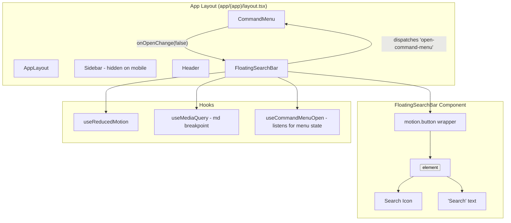

# Design Document: Mobile Floating Search

## Overview

This feature introduces a `FloatingSearchBar` component — a fixed-position, pill-shaped button rendered exclusively on mobile viewports (< 768px). It provides thumb-friendly access to the existing `CommandMenu` by dispatching the same `open-command-menu` window event used by the desktop `SearchTrigger`.

The component lifecycle:
1. **Mount** — enters with a fade + translateY entrance animation
2. **Resting** — compact pill with search icon + "Search" text
3. **Activation** — expands via scaleX transform, then dispatches the event
4. **Collapse** — returns to resting width when the command menu closes

The implementation leverages Framer Motion for JS-driven animations, the existing `useReducedMotion()` hook for accessibility, and Tailwind's responsive utilities for viewport-conditional rendering.

## Architecture



The `FloatingSearchBar` is a client component placed in the app layout alongside the existing `CommandMenu`. It conditionally renders based on a media query hook (or CSS `md:hidden` with DOM exclusion). The component manages its own expand/collapse animation state and communicates with the command menu exclusively through the existing window event pattern.

## Components and Interfaces

### FloatingSearchBar

**Location:** `components/layout/floating-search-bar.tsx`

```typescript
"use client"

// No props — self-contained component
export function FloatingSearchBar(): JSX.Element | null
```

**Internal State:**
- `isExpanded: boolean` — whether the bar is in expanded state (animating before menu opens)
- `commandMenuOpen: boolean` — tracks whether the command menu is currently open (via listening to its state)

**Behavior:**
1. Renders only when viewport < 768px (uses a `useIsMobile()` hook or equivalent media query check)
2. On click/keyboard activation:
   - If command menu is already open → no-op
   - Sets `isExpanded = true`, triggering the scaleX expansion animation
   - On animation complete → dispatches `window.dispatchEvent(new Event("open-command-menu"))`
3. Listens for command menu close → sets `isExpanded = false`, triggering collapse animation

**Animation Variants (Framer Motion):**

```typescript
const variants = {
  resting: { scaleX: 1, opacity: 1 },
  expanded: { scaleX: 1.75, opacity: 1 },  // ~140px * 1.75 ≈ 245px
}

const entranceVariants = {
  hidden: { opacity: 0, y: 12 },
  visible: { opacity: 1, y: 0 },
}
```

### useIsMobile Hook

**Location:** `hooks/use-is-mobile.ts`

```typescript
export function useIsMobile(): boolean
```

Uses `window.matchMedia("(max-width: 767px)")` with an event listener for changes. Returns `true` when viewport is below the `md` breakpoint. This ensures the component is not rendered in the DOM on desktop (satisfying Requirement 1.2).

### Integration with CommandMenu

The `CommandMenu` component already listens for the `open-command-menu` window event and calls `setOpen(true)`. The `FloatingSearchBar` needs to know when the menu closes to trigger its collapse animation. Two approaches:

**Chosen approach:** Listen for a custom `close-command-menu` event dispatched by the `CommandMenu` when it closes, OR use a `MutationObserver` / polling approach. The simplest integration is to add a `command-menu-closed` event dispatch in the `CommandMenu`'s `handleOpenChange` when `nextOpen === false`.

Alternatively, the `FloatingSearchBar` can detect the menu's open state by listening for the `open-command-menu` event it dispatched and then watching for the dialog to close via a DOM attribute check. The cleanest approach is to add a small event:

```typescript
// In CommandMenu's handleOpenChange:
if (!nextOpen) {
  window.dispatchEvent(new Event("close-command-menu"))
}
```

This keeps the coupling minimal — both components communicate through window events.

## Data Models

This feature has no data persistence requirements. All state is ephemeral UI state:

| State | Type | Scope | Description |
|-------|------|-------|-------------|
| `isExpanded` | `boolean` | Component | Whether the bar is in expanded animation state |
| `commandMenuOpen` | `boolean` | Component | Whether the command menu is currently open |
| `isMobile` | `boolean` | Hook | Whether viewport is below md breakpoint |
| `prefersReducedMotion` | `boolean` | Hook | Whether user prefers reduced motion |

No database tables, API routes, or server-side state are needed.

## Correctness Properties

*A property is a characteristic or behavior that should hold true across all valid executions of a system — essentially, a formal statement about what the system should do. Properties serve as the bridge between human-readable specifications and machine-verifiable correctness guarantees.*

### Property 1: Viewport-conditional rendering

*For any* viewport width, the FloatingSearchBar is rendered in the DOM if and only if the width is less than 768px. Conversely, for any viewport width >= 768px, the component must not be present in the DOM.

**Validates: Requirements 1.1, 1.2, 1.3**

### Property 2: All animations only use transform and opacity

*For any* animation variant or transition config defined in the FloatingSearchBar component (entrance, expansion, collapse), the only CSS properties being animated are `transform` and `opacity` — no layout-triggering properties (width, height, margin, padding, top, left, etc.) are animated.

**Validates: Requirements 3.2, 6.2**

### Property 3: Expansion and collapse duration within bounds

*For any* expansion or collapse animation config used by the FloatingSearchBar, the duration must be between 150ms and 200ms inclusive. The expansion must use ease-out easing and the collapse must use ease-in easing.

**Validates: Requirements 3.1, 3.5**

### Property 4: Entrance animation config within bounds

*For any* entrance animation config used by the FloatingSearchBar, the initial state must have opacity 0 and translateY of 12px, the final state must have opacity 1 and translateY of 0px, the duration must be between 150ms and 300ms inclusive, and the easing must be ease-out.

**Validates: Requirements 6.1**

### Property 5: Z-index within valid range

*For any* rendered instance of the FloatingSearchBar, its z-index value must be strictly greater than 30 and strictly less than 50.

**Validates: Requirements 5.3, 8.3**

## Error Handling

This component has minimal error surface since it performs no data fetching or external I/O. Error scenarios:

| Scenario | Handling |
|----------|----------|
| `window.matchMedia` not available (SSR) | Hook returns `false` by default; component not rendered server-side due to `"use client"` + initial state |
| `window.dispatchEvent` fails | Wrap in try/catch; fail silently (command menu simply won't open) |
| Animation callback (`onAnimationComplete`) not fired | Set a timeout fallback (250ms) that dispatches the event if the animation hasn't completed — prevents the bar from getting stuck in expanded state |
| `env(safe-area-inset-bottom)` not supported | CSS gracefully falls back to 0px, resulting in the base 24px offset (Requirement 5.4) |
| Low-performance device | The `useLowPerformance()` hook is not directly used here since the animations are lightweight (transform + opacity only), but if needed, duration can be reduced to the minimum (150ms) |

## Testing Strategy

### Unit Tests (Example-Based)

| Test | Validates |
|------|-----------|
| Renders search icon and "Search" text in resting state | Req 2.1 |
| Uses semantic design token classes (bg-app-surface, border-app, shadow-lg, rounded-full) | Req 2.3, 2.4 |
| Has `aria-label="Search"` on button element | Req 7.1 |
| Uses `<button type="button">` element | Req 7.3 |
| Dispatches `open-command-menu` event on activation | Req 3.3, 4.1 |
| Does not dispatch event when command menu is already open | Req 4.2 |
| Skips animation and dispatches immediately when reduced motion is active | Req 3.4, 6.3 |
| Keyboard activation (Enter/Space) triggers expansion | Req 7.4 |
| Not rendered in DOM at desktop viewport widths | Req 1.2, 8.2 |
| Focus indicator has outline with offset | Req 7.2 |

### Property-Based Tests (fast-check)

Each property test runs a minimum of 100 iterations.

| Property Test | Tag |
|---------------|-----|
| Viewport-conditional rendering | Feature: mobile-floating-search, Property 1: Viewport-conditional rendering |
| All animations only use transform and opacity | Feature: mobile-floating-search, Property 2: All animations only use transform and opacity |
| Expansion and collapse duration within bounds | Feature: mobile-floating-search, Property 3: Expansion and collapse duration within bounds |
| Entrance animation config within bounds | Feature: mobile-floating-search, Property 4: Entrance animation config within bounds |
| Z-index within valid range | Feature: mobile-floating-search, Property 5: Z-index within valid range |

### Testing Library

- **Property-based testing:** fast-check (already in the project)
- **Unit testing:** Vitest + @testing-library/react
- **Test location:** `__tests__/mobile-floating-search/`

### Integration Considerations

- The command menu integration (event dispatch/listen) should be tested by rendering both components together and verifying the full activation flow
- Safe area inset behavior requires manual testing on physical iOS devices or Safari simulator
- Visual regression of the pill shape and positioning is best verified manually or with screenshot tests
