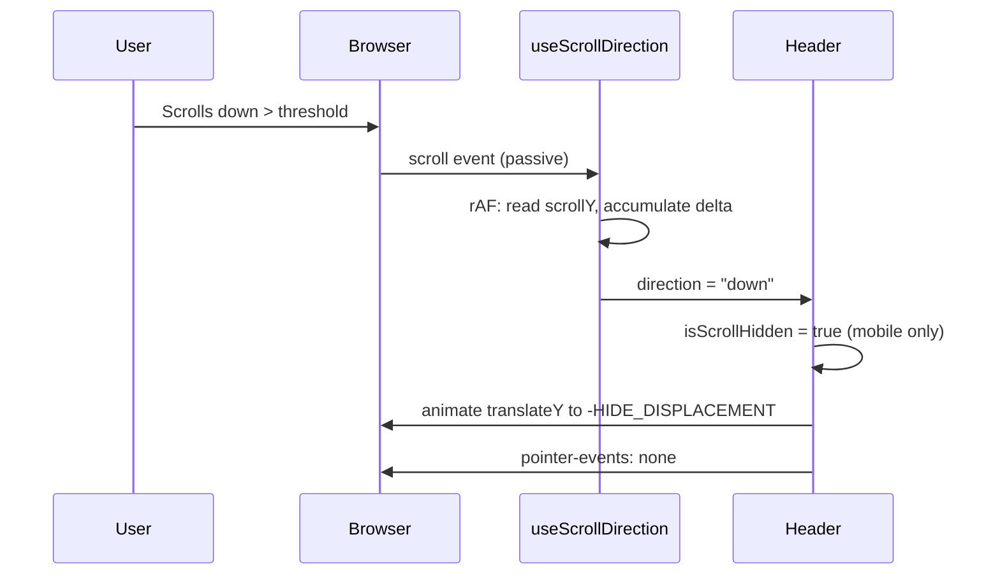
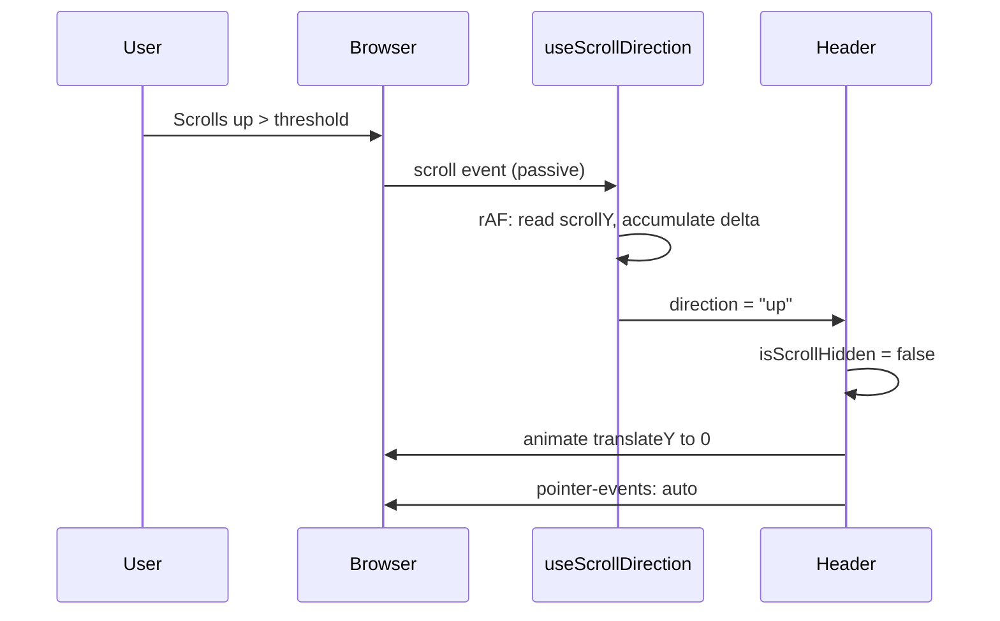

# Design Document: Mobile Scroll Hide Header

## Overview

This feature adds scroll-driven hide/show behavior to the existing `Header` component on mobile viewports (below 768px). When the user scrolls down, the header translates upward off-screen. When the user scrolls up (or reaches the top of the page), it slides back into view. This mirrors the existing `FloatingSearchBar` scroll-hide pattern but in the opposite direction (negative Y translation since the header is at the top).

The implementation converts the `Header` from a server component to a client component, wraps it in a Framer Motion container, and consumes the existing `useScrollDirection` hook. The approach prioritizes performance (transform-only animation, passive listeners, rAF throttling) and accessibility (reduced motion, low-performance degradation).

### Key Design Decisions

1. **Reuse `useScrollDirection` hook**: The hook already exists and is battle-tested by the FloatingSearchBar feature. No modifications needed.
2. **Client component conversion**: The Header must become a `"use client"` component to consume hooks (`useScrollDirection`, `useIsMobile`, `useReducedMotion`, `useLowPerformance`).
3. **Negative Y translation**: Unlike the FloatingSearchBar which translates downward (+Y), the Header translates upward (-Y) since it's positioned at the top of the viewport.
4. **Framer Motion `animate` prop**: Uses Framer Motion's `animate` prop with `translateY` for consistency with the FloatingSearchBar and to get native mid-transition interruption support.
5. **Mobile-only behavior**: On desktop (≥768px), the header remains sticky with no scroll-hide logic and no scroll listeners attached.
6. **Preserve sticky behavior on desktop**: The header keeps `sticky top-0 z-40` on desktop. On mobile, it switches to `fixed top-0` with transform-based hide/show.

## Architecture

```mermaid
graph TD
    subgraph Browser
        SE[Scroll Events]
    end

    subgraph Hooks
        USD[useScrollDirection]
        UIM[useIsMobile]
        URM[useReducedMotion]
        ULP[useLowPerformance]
    end

    subgraph Components
        HDR[Header - modified]
        FSB[FloatingSearchBar - unchanged]
    end

    subgraph Motion System
        LM[lib/motion.ts]
    end

    SE -->|passive listener + rAF| USD
    USD -->|"up" / "down" / null| HDR
    UIM -->|boolean| HDR
    URM -->|boolean| HDR
    ULP -->|boolean| HDR
    LM -->|duration, easing constants| HDR
    HDR -->|translateY animation| Browser
    FSB -.->|independent, same hook| USD
```

### Sequence Diagram: Scroll Down (Hide)



### Sequence Diagram: Scroll Up (Show)



## Components and Interfaces

### `useScrollDirection` Hook (Reused, Unchanged)

**File**: `hooks/use-scroll-direction.ts`

```typescript
type ScrollDirection = "up" | "down" | null

interface UseScrollDirectionOptions {
  threshold?: number // default: 10 (pixels), constrained to 8-20
}

function useScrollDirection(options?: UseScrollDirectionOptions): ScrollDirection
```

No modifications needed. The Header consumes this hook identically to how the FloatingSearchBar does.

### `Header` Component (Modified)

**File**: `components/layout/header.tsx`

**Current**: Server component with `sticky top-0 z-40`.

**New**: Client component with scroll-hide behavior on mobile.

```typescript
"use client"

import { motion } from "framer-motion"
import type { Transition } from "framer-motion"

import { useIsMobile } from "@/hooks/use-is-mobile"
import { useReducedMotion } from "@/hooks/use-reduced-motion"
import { useLowPerformance } from "@/hooks/use-low-performance"
import { useScrollDirection } from "@/hooks/use-scroll-direction"
import { DURATION, EASING } from "@/lib/motion"

import { MobileSidebar } from "./mobile-sidebar"
import { UserMenu } from "./user-menu"
import { SearchTrigger } from "./search-trigger"
```

**New exported constants for testing**:

```typescript
/**
 * Hide transition config: ease-in, 200ms.
 * Used when the header translates upward off-screen on scroll down.
 */
export const headerHideTransition: Transition = {
  duration: DURATION.normal, // 0.2s = 200ms
  ease: EASING.exit,         // ease-in
}

/**
 * Show transition config: ease-out, 200ms.
 * Used when the header translates back into view on scroll up.
 */
export const headerShowTransition: Transition = {
  duration: DURATION.normal, // 0.2s = 200ms
  ease: EASING.entrance,     // ease-out
}

/**
 * The translateY displacement when hidden (px, negative = upward).
 * Calculated as: height (64px / h-16) + border (1px) + shadow buffer (3px) = 68px.
 * The header translates upward by this amount to fully leave the viewport.
 */
export const HEADER_HIDE_DISPLACEMENT = -68

/**
 * Default scroll threshold in pixels for the header.
 * Matches the FloatingSearchBar threshold for consistent UX.
 */
export const HEADER_SCROLL_THRESHOLD = 10
```

**Responsibilities**:
- Render the navigation header with mobile sidebar toggle, search trigger, and user menu
- On mobile: consume `useScrollDirection` and animate translateY based on direction
- On desktop: remain sticky with no scroll-hide logic
- Respect reduced motion and low-performance preferences
- Maintain z-index layering (z-40) in both states

### `FloatingSearchBar` Component (Unchanged)

**File**: `components/layout/floating-search-bar.tsx`

No modifications. Both components independently consume `useScrollDirection` and animate independently. They share the same scroll threshold for consistent UX.

## Data Models

This feature is entirely client-side and introduces no new data models, database tables, or API routes.

**State managed in `Header`**:

| Field | Type | Description |
|-------|------|-------------|
| `isScrollHidden` | `boolean` (derived) | Whether the header should be off-screen (mobile only) |

**Derived from hooks**:

| Hook | Value | Usage |
|------|-------|-------|
| `useScrollDirection` | `"up" \| "down" \| null` | Determines hide/show state |
| `useIsMobile` | `boolean` | Gates scroll-hide behavior to mobile only |
| `useReducedMotion` | `boolean` | Sets transition duration to 0 |
| `useLowPerformance` | `boolean` | Sets transition duration to 0 |

## Algorithmic Pseudocode

### Header Scroll-Hide Algorithm

```typescript
ALGORITHM headerScrollHide(scrollDirection, isMobile, prefersReducedMotion, isLowPerf)
INPUT: scrollDirection ∈ {"up", "down", null}, isMobile: boolean, 
       prefersReducedMotion: boolean, isLowPerf: boolean
OUTPUT: { translateY: number, pointerEvents: string, transition: Transition }

BEGIN
  // Gate: only apply scroll-hide on mobile
  IF NOT isMobile THEN
    RETURN { translateY: 0, pointerEvents: "auto", transition: { duration: 0 } }
  END IF

  // Derive hidden state from scroll direction
  isScrollHidden ← (scrollDirection === "down")

  // Determine translateY target
  IF isScrollHidden THEN
    translateY ← HEADER_HIDE_DISPLACEMENT  // -68px (upward)
  ELSE
    translateY ← 0
  END IF

  // Determine pointer-events
  IF isScrollHidden THEN
    pointerEvents ← "none"
  ELSE
    pointerEvents ← "auto"
  END IF

  // Determine transition (degraded mode = instant)
  IF prefersReducedMotion OR isLowPerf THEN
    transition ← { duration: 0 }
  ELSE IF isScrollHidden THEN
    transition ← headerHideTransition  // ease-in, 200ms
  ELSE
    transition ← headerShowTransition  // ease-out, 200ms
  END IF

  RETURN { translateY, pointerEvents, transition }
END
```

**Preconditions:**
- `useScrollDirection` hook is initialized and returning valid direction
- `useIsMobile` correctly detects viewport width < 768px
- Component is mounted in the browser (client-side)

**Postconditions:**
- Header is fully hidden (no pixels visible) when `isScrollHidden = true`
- Header is fully visible and interactive when `isScrollHidden = false`
- No layout-triggering properties are animated
- Transition respects reduced motion and low-performance preferences

## Key Functions with Formal Specifications

### Function: `Header()`

```typescript
export function Header(): JSX.Element
```

**Preconditions:**
- Component is rendered within the app shell layout
- Required child components (`MobileSidebar`, `UserMenu`, `SearchTrigger`) are available

**Postconditions:**
- On desktop: renders as `sticky top-0 z-40` with no scroll-hide behavior
- On mobile: renders as `fixed top-0 z-40` with scroll-direction-based translateY animation
- `pointer-events` is `"none"` when hidden, `"auto"` when visible
- Transition duration is 0 when reduced motion or low-performance is active
- The header's translateY displacement fully removes it from the viewport when hidden

### Function: Derived `isScrollHidden`

```typescript
const isScrollHidden: boolean = isMobile && scrollDirection === "down"
```

**Preconditions:**
- `isMobile` is a boolean from `useIsMobile()`
- `scrollDirection` is from `useScrollDirection({ threshold: HEADER_SCROLL_THRESHOLD })`

**Postconditions:**
- `true` if and only if viewport is mobile AND user has scrolled down past threshold
- `false` when direction is `"up"`, `null`, or viewport is desktop
- When `scrollY === 0`, `useScrollDirection` returns `null`, so header is always visible at top

## Example Usage

```typescript
"use client"

import { motion } from "framer-motion"
import { useIsMobile } from "@/hooks/use-is-mobile"
import { useReducedMotion } from "@/hooks/use-reduced-motion"
import { useLowPerformance } from "@/hooks/use-low-performance"
import { useScrollDirection } from "@/hooks/use-scroll-direction"
import { DURATION, EASING } from "@/lib/motion"
import { MobileSidebar } from "./mobile-sidebar"
import { UserMenu } from "./user-menu"
import { SearchTrigger } from "./search-trigger"

export const HEADER_HIDE_DISPLACEMENT = -68
export const HEADER_SCROLL_THRESHOLD = 10

export const headerHideTransition = {
  duration: DURATION.normal,
  ease: EASING.exit,
}

export const headerShowTransition = {
  duration: DURATION.normal,
  ease: EASING.entrance,
}

export function Header() {
  const isMobile = useIsMobile()
  const prefersReducedMotion = useReducedMotion()
  const isLowPerf = useLowPerformance()
  const scrollDirection = useScrollDirection({ threshold: HEADER_SCROLL_THRESHOLD })

  // Only hide on mobile when scrolling down
  const isScrollHidden = isMobile && scrollDirection === "down"

  // Determine transition
  const scrollTransition =
    prefersReducedMotion || isLowPerf
      ? { duration: 0 }
      : isScrollHidden
        ? headerHideTransition
        : headerShowTransition

  // Desktop: sticky header, no animation wrapper needed
  // Mobile: fixed header with translateY animation
  return (
    <motion.header
      className="fixed top-0 left-0 right-0 z-40 flex h-16 items-center justify-between border-b border-app bg-app-surface/80 px-6 pr-8 backdrop-blur-xl safe-area-header md:sticky md:left-auto md:right-auto"
      style={{
        pointerEvents: isScrollHidden ? "none" : "auto",
      }}
      animate={{ y: isScrollHidden ? HEADER_HIDE_DISPLACEMENT : 0 }}
      transition={scrollTransition}
    >
      <div className="flex items-center gap-4">
        <MobileSidebar />
      </div>

      <div className="flex items-center gap-3">
        <SearchTrigger />
        <UserMenu />
      </div>
    </motion.header>
  )
}
```

## Correctness Properties

*A property is a characteristic or behavior that should hold true across all valid executions of a system-essentially, a formal statement about what the system should do. Properties serve as the bridge between human-readable specifications and machine-verifiable correctness guarantees.*

### Property 1: Direction-to-visibility mapping

*For any* scroll direction value returned by `useScrollDirection` on a mobile viewport: if the direction is `"down"`, the Header SHALL be in Hidden_State (translateY = HEADER_HIDE_DISPLACEMENT); if the direction is `"up"` or `null`, the Header SHALL be in Visible_State (translateY = 0).

**Validates: Requirements 1.1, 1.5, 2.1, 2.2, 7.4**

### Property 2: Pointer-events follows visibility state

*For any* visibility state of the Header on mobile: when the header is in Hidden_State, the computed `pointer-events` value SHALL be `"none"`; when the header is in Visible_State, the computed `pointer-events` value SHALL be `"auto"`.

**Validates: Requirements 1.3, 2.3**

### Property 3: Scroll-top forces visible

*For any* prior scroll direction or visibility state, when `window.scrollY` equals 0 the Header SHALL be in Visible_State with `pointer-events: auto` (because `useScrollDirection` returns `null` at scrollY=0).

**Validates: Requirement 2.2**

### Property 4: Desktop viewport disables scroll-hide

*For any* scroll direction value, when the viewport width is ≥ 768px (desktop), the Header SHALL remain in Visible_State (translateY = 0) with `pointer-events: auto`, regardless of scroll direction.

**Validates: Requirements 4.1, 4.4**

### Property 5: Animation duration and easing bounds

*For any* hide/show transition configuration: the hide transition SHALL have a duration between 150ms and 300ms with ease-in easing, and the show transition SHALL have a duration between 150ms and 300ms with ease-out easing.

**Validates: Requirements 3.1, 3.2**

### Property 6: Only transform is animated

*For any* hide/show animation, the animated property SHALL be limited to `transform` (translateY). No layout-triggering properties (`width`, `height`, `top`, `bottom`, `left`, `right`, `margin`, `padding`) SHALL be present in the animation.

**Validates: Requirement 3.3**

### Property 7: Degraded mode applies zero duration

*For any* hide/show transition triggered while either `prefers-reduced-motion: reduce` is active OR the device is detected as low-performance, the effective transition duration SHALL be 0. The visibility state and pointer-events SHALL still update correctly in response to scroll direction.

**Validates: Requirements 5.1, 5.2, 6.1, 6.2, 6.3**

### Property 8: Hide displacement fully removes header from viewport

*For any* Header in Hidden_State, the absolute value of `HEADER_HIDE_DISPLACEMENT` SHALL be greater than or equal to the header's rendered height (64px) plus its border width (1px), ensuring no part of the header is visible within the viewport.

**Validates: Requirements 1.2, 3.5**

### Property 9: Header and FloatingSearchBar operate independently

*For any* scroll event sequence, the Header's visibility state SHALL be determined solely by `useScrollDirection` and `useIsMobile` — it SHALL NOT be affected by the FloatingSearchBar's state, and vice versa.

**Validates: Requirement 7.1**

### Property 10: Mid-transition interruption starts from current position

*For any* in-progress hide or show transition, if the opposite transition is triggered (direction reversal), the Header SHALL begin the new transition from its current translateY position without snapping to the start or end of the interrupted transition.

**Validates: Requirements 2.4, 3.4**

## Error Handling

| Scenario | Handling |
|----------|----------|
| `window` undefined (SSR) | Hooks return safe defaults (`null` direction, `false` for isMobile); header renders in Visible_State. The `"use client"` directive ensures hooks only run client-side. |
| `useIsMobile` returns `undefined` briefly on mount | Treat as desktop (no scroll-hide) until hydration completes — safe default. |
| Framer Motion animation interrupted | Framer Motion handles mid-transition interruption natively — new `animate` values start from current position. |
| Viewport resize crosses 768px breakpoint | `useIsMobile` updates; if switching to desktop, header immediately returns to translateY=0 with no animation. |
| Multiple rapid direction changes | Threshold + delta reset in `useScrollDirection` prevents jitter; at most one state update per rAF frame. |
| Header height changes (e.g., safe-area-inset) | `HEADER_HIDE_DISPLACEMENT` is set to -68px which accounts for h-16 (64px) + border (1px) + buffer (3px). If height changes, the constant must be updated. |

## Testing Strategy

### Property-Based Tests (fast-check)

Property-based tests use **fast-check** with a minimum of 100 iterations per property. Each test references its design property via a tag comment.

**Tag format**: `Feature: mobile-scroll-hide-header, Property {N}: {title}`

**Test directory**: `__tests__/mobile-scroll-hide-header/`

| Test File | Properties Covered |
|-----------|-------------------|
| `direction-visibility-mapping.property.test.ts` | Property 1, 3, 4 |
| `pointer-events-state.property.test.ts` | Property 2 |
| `animation-constraints.property.test.ts` | Property 5, 6 |
| `degraded-mode-duration.property.test.ts` | Property 7 |
| `hide-displacement-bounds.property.test.ts` | Property 8 |

**Configuration**: Each property test runs with `fc.assert(fc.property(...), { numRuns: 100 })`.

### Unit Tests (example-based)

| Test | Validates |
|------|-----------|
| Header renders with correct classes on desktop | Desktop sticky behavior preserved |
| Header renders with fixed positioning on mobile | Mobile positioning correct |
| `HEADER_HIDE_DISPLACEMENT` absolute value ≥ 65 (height + border) | Property 8 |
| `HEADER_SCROLL_THRESHOLD` is between 8 and 20 | Threshold bounds |
| `headerHideTransition` has ease-in easing | Property 5 |
| `headerShowTransition` has ease-out easing | Property 5 |
| Duration is 0 when `prefersReducedMotion` is true | Property 7 |
| Duration is 0 when `isLowPerf` is true | Property 7 |
| `isScrollHidden` is false when `isMobile` is false | Property 4 |
| `pointer-events` is "none" when hidden | Property 2 |
| `pointer-events` is "auto" when visible | Property 2 |
| Header visible when scrollDirection is null | Property 3 |

### Integration Tests

| Test | Validates |
|------|-----------|
| Full scroll down → hide → scroll up → show cycle on mobile | End-to-end behavior |
| Header and FloatingSearchBar hide/show independently | Property 9 |
| Viewport resize from mobile to desktop restores header | Responsive behavior |

### Test Generators (for property tests)

- **Scroll direction generator**: `fc.constantFrom("up", "down", null)` for direction values.
- **Viewport generator**: `fc.boolean()` for `isMobile` flag.
- **Accessibility flag generator**: `fc.record({ reducedMotion: fc.boolean(), lowPerf: fc.boolean() })` for degradation combinations.
- **Displacement generator**: `fc.integer({ min: -200, max: 0 })` for testing displacement bounds.

## Performance Considerations

- **Transform-only animation**: Only `translateY` is animated — no layout recalculations triggered.
- **Passive scroll listener**: The `useScrollDirection` hook uses `{ passive: true }` to avoid blocking the scroll thread.
- **rAF throttling**: At most one `scrollY` read per animation frame, regardless of scroll event frequency.
- **No additional listeners**: The Header reuses the same `useScrollDirection` hook pattern — each component instance creates its own listener, but the cost is minimal (one passive listener + one rAF per frame).
- **GPU compositing**: `transform` animations are handled by the GPU compositor, avoiding main-thread paint operations.
- **Instant degradation**: On low-performance devices, duration is 0 — no animation frames computed.

## Security Considerations

No security implications. This feature is entirely client-side UI behavior with no data access, network requests, or authentication changes.

## Dependencies

| Dependency | Purpose | Already in project |
|------------|---------|-------------------|
| `framer-motion` | Animation (translateY) | ✅ Yes |
| `@/hooks/use-scroll-direction` | Scroll direction detection | ✅ Yes |
| `@/hooks/use-is-mobile` | Mobile viewport detection | ✅ Yes |
| `@/hooks/use-reduced-motion` | Reduced motion preference | ✅ Yes |
| `@/hooks/use-low-performance` | Low-performance device detection | ✅ Yes |
| `@/lib/motion` | Duration and easing constants | ✅ Yes |

No new dependencies required. All infrastructure is already in place from the FloatingSearchBar scroll-hide feature.
