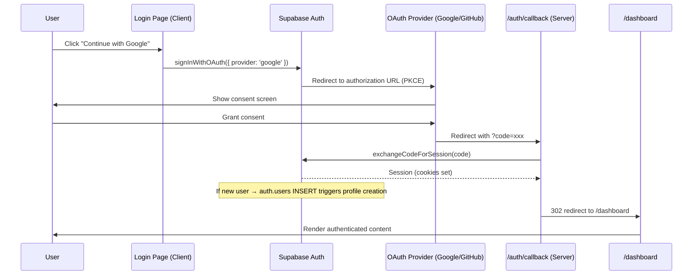
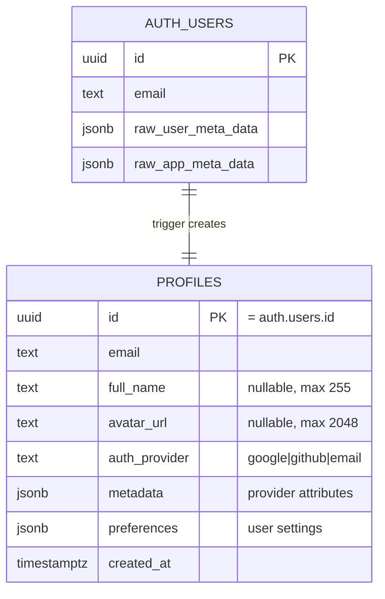

# Design Document: OAuth Authentication

## Overview

This feature adds OAuth-based authentication via Google and GitHub to Home OS, complementing the existing email/password flow. The implementation leverages Supabase Auth's built-in OAuth support with PKCE flow, meaning the core token exchange, session management, and token refresh are handled by Supabase — not custom code.

The design focuses on three areas:
1. **Login Page UI** — Adding provider-agnostic OAuth buttons above the existing form
2. **Callback Handler** — Hardening the existing `app/auth/callback/route.ts` with error handling
3. **Profile Schema** — Extending the `profiles` table to store provider metadata (avatar, name, provider, JSONB metadata)

### Key Design Decisions

1. **Supabase-managed OAuth flow**: Rather than implementing custom OAuth token exchange, we use `supabase.auth.signInWithOAuth()` on the client and `supabase.auth.exchangeCodeForSession()` on the callback route. Supabase handles PKCE, token storage, and refresh internally.
2. **Provider-agnostic callback**: The existing `/auth/callback` route already works for any Supabase-supported provider. No provider-specific branching is needed.
3. **Database trigger for profile creation**: A PostgreSQL trigger on `auth.users` inserts a `profiles` row on first sign-up, extracting metadata from the OAuth provider's `raw_user_meta_data`.
4. **Reusable OAuthButton component**: A single component accepts provider config as props, making future provider additions a one-line change.
5. **Toast-based error feedback**: Errors from the OAuth flow are communicated via Sonner toast notifications (already in the project), not alerts or inline error components.

## Architecture



### System Context

```mermaid
graph TD
    subgraph "Client (Browser)"
        LP[Login Page]
        OB[OAuthButton Component]
        LP --> OB
    end

    subgraph "Next.js Server"
        CB[/auth/callback route.ts]
        MW[Middleware]
    end

    subgraph "Supabase"
        SA[Supabase Auth]
        DB[(PostgreSQL)]
        TR[Profile Trigger]
    end

    subgraph "External"
        G[Google OAuth]
        GH[GitHub OAuth]
    end

    OB -->|signInWithOAuth| SA
    SA -->|redirect| G
    SA -->|redirect| GH
    G -->|code| CB
    GH -->|code| CB
    CB -->|exchangeCodeForSession| SA
    SA -->|session cookies| CB
    TR -->|INSERT profiles| DB
    MW -->|getUser()| SA
```

### File Changes Summary

| File | Action | Purpose |
|------|--------|---------|
| `app/login/page.tsx` | Modify | Add OAuth buttons, toast error display |
| `app/auth/callback/route.ts` | Modify | Add error handling, provider error detection |
| `components/auth/oauth-button.tsx` | Create | Reusable OAuth button component |
| `lib/auth/oauth-providers.ts` | Create | Provider configuration registry |
| `supabase/migrations/YYYYMMDD_profiles_oauth_fields.sql` | Create | Add avatar_url, full_name, auth_provider, metadata columns |
| `types/database.ts` | Regenerate | Reflect new profile columns |

## Components and Interfaces

### Component Hierarchy

```
app/login/page.tsx (Client Component)
├── OAuthButtonGroup
│   ├── OAuthButton (provider="google")
│   └── OAuthButton (provider="github")
├── Divider ("or")
├── Email/Password Form (existing)
└── FooterNav (existing)
```

### OAuthButton Component

```typescript
// components/auth/oauth-button.tsx
"use client";

type OAuthButtonProps = {
  provider: string;          // Supabase provider identifier (max 32 chars)
  label: string;             // Display label (max 64 chars), e.g. "Continue with Google"
  icon: React.ReactNode;     // Provider icon (SVG or component)
  disabled?: boolean;
  loading?: boolean;
  onClick: () => void;
};
```

The component renders a full-width button with:
- Provider icon on the left
- Label text centered
- Loading spinner replaces icon when `loading=true`, label changes to "Connecting..."
- `aria-label="Sign in with {provider name}"`
- Minimum height 48px, `rounded-xl`, `bg-app-elevated` background
- Hover: background opacity transition over 150ms
- Disabled state: `opacity-50`, pointer-events none
- Keyboard focusable with visible focus ring

### OAuthButtonGroup Component

```typescript
// components/auth/oauth-button-group.tsx
"use client";

type OAuthButtonGroupProps = {
  onError: (message: string) => void;
};
```

Manages the OAuth flow state:
- Tracks which provider is currently loading (or null)
- Calls `supabase.auth.signInWithOAuth()` with the selected provider
- Disables all buttons while any flow is in progress
- Calls `onError` if the OAuth initiation fails (e.g., popup blocked, network error)
- Implements a 10-second timeout that resets loading state and shows timeout error

### Provider Configuration

```typescript
// lib/auth/oauth-providers.ts

type OAuthProviderConfig = {
  id: string;                              // Supabase provider ID
  name: string;                            // Display name
  icon: React.ComponentType<{ className?: string }>;  // Icon component
  label: string;                           // Button label
};

export const OAUTH_PROVIDERS: OAuthProviderConfig[] = [
  { id: "google", name: "Google", icon: GoogleIcon, label: "Continue with Google" },
  { id: "github", name: "GitHub", icon: GitHubIcon, label: "Continue with GitHub" },
];
```

Adding a new provider requires:
1. Add entry to `OAUTH_PROVIDERS` array
2. Enable provider in Supabase dashboard
3. Set credentials in environment variables

### Auth Callback Handler (Enhanced)

```typescript
// app/auth/callback/route.ts

export async function GET(request: Request) {
  const requestUrl = new URL(request.url);
  const code = requestUrl.searchParams.get("code");
  const error = requestUrl.searchParams.get("error");
  const errorDescription = requestUrl.searchParams.get("error_description");

  // Handle provider-reported errors
  if (error) {
    const message = errorDescription || "Authentication was denied";
    return NextResponse.redirect(
      new URL(`/login?error_description=${encodeURIComponent(message)}`, request.url)
    );
  }

  // Handle missing code
  if (!code) {
    return NextResponse.redirect(
      new URL("/login?error_description=Authorization+code+missing", request.url)
    );
  }

  // Exchange code for session
  const cookieStore = await cookies();
  const supabase = createServerClient(/* ... */);
  const { error: exchangeError } = await supabase.auth.exchangeCodeForSession(code);

  if (exchangeError) {
    return NextResponse.redirect(
      new URL("/login?error_description=Authentication+failed", request.url)
    );
  }

  return NextResponse.redirect(new URL("/dashboard", request.url));
}
```

### Login Page Error Display

The login page reads `error_description` from the URL search params on mount and displays it as a Sonner toast:

```typescript
// In app/login/page.tsx
useEffect(() => {
  const params = new URLSearchParams(window.location.search);
  const errorDesc = params.get("error_description");
  if (errorDesc) {
    toast.error(errorDesc.slice(0, 200));
    // Clean URL without reload
    window.history.replaceState({}, "", "/login");
  }
}, []);
```

### File Structure

```
components/auth/
  oauth-button.tsx          # Single OAuth button component
  oauth-button-group.tsx    # Group managing flow state
  oauth-icons.tsx           # Google and GitHub SVG icons
lib/auth/
  oauth-providers.ts        # Provider configuration array
```

## Data Models

### Profiles Table (Extended)

The existing `profiles` table needs additional columns for OAuth user data:

```sql
-- supabase/migrations/YYYYMMDD_profiles_oauth_fields.sql

ALTER TABLE public.profiles
  ADD COLUMN IF NOT EXISTS full_name text,
  ADD COLUMN IF NOT EXISTS avatar_url text,
  ADD COLUMN IF NOT EXISTS auth_provider text,
  ADD COLUMN IF NOT EXISTS metadata jsonb NOT NULL DEFAULT '{}'::jsonb;

-- Constraints
ALTER TABLE public.profiles
  ADD CONSTRAINT profiles_full_name_length CHECK (char_length(full_name) <= 255),
  ADD CONSTRAINT profiles_avatar_url_length CHECK (char_length(avatar_url) <= 2048),
  ADD CONSTRAINT profiles_auth_provider_length CHECK (char_length(auth_provider) <= 32);
```

### Profile Record Type

```typescript
// Updated profiles type in types/database.ts (after regeneration)
type ProfileRow = {
  id: string;                    // = auth.users.id
  email: string | null;
  created_at: string | null;
  full_name: string | null;      // NEW: from OAuth provider display name
  avatar_url: string | null;     // NEW: from OAuth provider profile image
  auth_provider: string | null;  // NEW: "google", "github", "email"
  metadata: Record<string, unknown>;  // NEW: flexible provider attributes
  preferences: Record<string, unknown>;  // existing
};
```

### Database Trigger for Profile Creation

A PostgreSQL function triggered on `auth.users` INSERT creates the profile row automatically:

```sql
-- In the same migration file

CREATE OR REPLACE FUNCTION public.handle_new_user()
RETURNS trigger
LANGUAGE plpgsql
SECURITY DEFINER SET search_path = ''
AS $$
DECLARE
  v_full_name text;
  v_avatar_url text;
  v_provider text;
BEGIN
  -- Extract provider from app_metadata
  v_provider := NEW.raw_app_meta_data ->> 'provider';

  -- Extract display name (truncate to 255)
  v_full_name := LEFT(COALESCE(
    NEW.raw_user_meta_data ->> 'full_name',
    NEW.raw_user_meta_data ->> 'name',
    NULL
  ), 255);

  -- Extract avatar URL (truncate to 2048)
  v_avatar_url := LEFT(COALESCE(
    NEW.raw_user_meta_data ->> 'avatar_url',
    NEW.raw_user_meta_data ->> 'picture',
    NULL
  ), 2048);

  -- Set null for empty strings
  IF v_full_name = '' THEN v_full_name := NULL; END IF;
  IF v_avatar_url = '' THEN v_avatar_url := NULL; END IF;

  INSERT INTO public.profiles (id, email, full_name, avatar_url, auth_provider, metadata, created_at)
  VALUES (
    NEW.id,
    NEW.email,
    v_full_name,
    v_avatar_url,
    COALESCE(v_provider, 'email'),
    COALESCE(NEW.raw_user_meta_data, '{}'::jsonb),
    NOW()
  )
  ON CONFLICT (id) DO NOTHING;

  RETURN NEW;
END;
$$;

-- Create trigger (drop first if exists for idempotency)
DROP TRIGGER IF EXISTS on_auth_user_created ON auth.users;
CREATE TRIGGER on_auth_user_created
  AFTER INSERT ON auth.users
  FOR EACH ROW EXECUTE FUNCTION public.handle_new_user();
```

### RLS Policies

The existing RLS policy on `profiles` (`auth.uid() = id`) continues to work for OAuth users since `profiles.id` equals `auth.users.id` regardless of auth method.

### Entity Relationship



## Correctness Properties

*A property is a characteristic or behavior that should hold true across all valid executions of a system — essentially, a formal statement about what the system should do. Properties serve as the bridge between human-readable specifications and machine-verifiable correctness guarantees.*

### Property 1: Profile creation correctly maps and truncates OAuth metadata

*For any* valid OAuth user metadata (containing arbitrary combinations of `full_name`/`name`, `avatar_url`/`picture`, and `provider` fields with strings of any length), the profile creation trigger SHALL produce a profile row where:
- `full_name` equals the first 255 characters of the provider's display name (or null if empty/missing)
- `avatar_url` equals the first 2048 characters of the provider's image URL (or null if missing)
- `auth_provider` equals the provider identifier from `raw_app_meta_data`
- `email` equals the user's email

**Validates: Requirements 3.2, 3.3, 3.4, 3.5, 3.7, 3.8**

### Property 2: Profile creation is idempotent

*For any* existing profile record, if the auth trigger fires again for the same user ID (simulating a returning OAuth user), the profiles table SHALL contain exactly one row for that user ID with the original data unchanged.

**Validates: Requirements 3.6**

### Property 3: Middleware route protection is consistent

*For any* path in the protected routes list and any session state (valid user or null), the middleware SHALL redirect to `/login` if and only if `getUser()` returns null, and SHALL allow access (return next response) if and only if `getUser()` returns a valid user object.

**Validates: Requirements 4.2, 4.4, 8.4**

### Property 4: OAuthButton renders correctly for any valid provider configuration

*For any* provider configuration with a name (string ≤ 32 characters), label (string ≤ 64 characters), and icon (valid React node), the OAuthButton component SHALL render a button element with:
- `aria-label` equal to "Sign in with {provider name}"
- Visible label text matching the provided label
- Disabled state and "Connecting..." text when loading is true for that provider
- All sibling buttons disabled when any provider is in loading state

**Validates: Requirements 5.4, 5.6, 9.4**

### Property 5: Error messages are sanitized and bounded

*For any* error_description string (including strings containing stack traces, raw error codes, HTML, or arbitrary Unicode), the Login Page SHALL display a toast message that is at most 200 characters long and does not contain raw technical details (stack frames, HTTP status codes in numeric format, or JSON error objects).

**Validates: Requirements 7.1, 7.5**

## Error Handling

### OAuth Flow Initiation Errors

| Error | Detection | User Feedback | Recovery |
|-------|-----------|---------------|----------|
| Network timeout (>10s) | Client-side timer | Toast: "Connection timed out. Please try again." | Re-enable buttons, show retry |
| Provider unavailable (5xx) | Error callback from Supabase | Toast: "Google/GitHub is temporarily unavailable" | Re-enable buttons |
| signInWithOAuth SDK error | Rejected promise | Toast: "Sign-in could not be started" | Re-enable buttons |
| Provider not configured | Supabase returns error | Toast: "This sign-in method is not available" | Re-enable buttons |

### Auth Callback Errors

| Error | Detection | Response |
|-------|-----------|----------|
| Missing `code` param | `!searchParams.get("code")` | Redirect to `/login?error_description=Authorization+code+missing` |
| Provider error param | `searchParams.get("error")` exists | Redirect to `/login?error_description={provider_message}` |
| Code exchange failure | `exchangeCodeForSession` returns error | Redirect to `/login?error_description=Authentication+failed` |
| Network/timeout during exchange | Exception thrown | Redirect to `/login?error_description=Authentication+failed` |

### Profile Creation Errors

| Error | Detection | Response |
|-------|-----------|----------|
| Trigger INSERT fails | PostgreSQL exception in trigger | Trigger uses ON CONFLICT DO NOTHING — if profile already exists, no error. If genuine DB error, Supabase logs it. |
| Missing metadata fields | NULL values in raw_user_meta_data | Trigger handles gracefully — sets fields to NULL |
| Constraint violation (name > 255) | CHECK constraint | Trigger pre-truncates with LEFT() — constraint never fires |

### Error Message Sanitization

The login page applies these rules before displaying any error:
1. Truncate to 200 characters maximum
2. Strip any content that looks like a stack trace (lines starting with `at `)
3. Never display raw HTTP status codes or JSON error objects
4. Fall back to "Authentication failed" if the message is empty after sanitization

## Testing Strategy

### Testing Approach

This feature uses a **dual testing approach**:
- **Property-based tests** (fast-check): Verify universal properties across generated inputs for the profile creation logic, middleware routing, component rendering, and error sanitization
- **Example-based unit tests** (Vitest + Testing Library): Verify specific OAuth flow scenarios, UI interactions, and integration points

### Property-Based Tests

| Property | Test File | What's Generated | What's Verified |
|----------|-----------|------------------|-----------------|
| 1: Profile metadata mapping | `__tests__/auth/profile-creation.property.test.ts` | Random user metadata objects with varying field presence, string lengths (0–5000 chars), Unicode content | Correct field extraction, truncation, null handling |
| 2: Profile idempotency | `__tests__/auth/profile-creation.property.test.ts` | Random existing profiles + duplicate insert attempts | Single row preserved, no data corruption |
| 3: Middleware protection | `__tests__/auth/middleware-protection.property.test.ts` | Random protected route paths × session states (valid/null) | Correct redirect/allow decision |
| 4: OAuthButton rendering | `__tests__/auth/oauth-button.property.test.ts` | Random provider configs (names ≤32 chars, labels ≤64 chars) × loading states | Correct aria-labels, disabled states, label text |
| 5: Error sanitization | `__tests__/auth/error-sanitization.property.test.ts` | Random error strings (including stack traces, long strings, special chars) | Output ≤200 chars, no raw technical content |

**Configuration:**
- Library: `fast-check` (already installed)
- Minimum iterations: 100 per property
- Tag format: `Feature: oauth-authentication, Property {N}: {title}`

### Example-Based Unit Tests

| Test Area | File | Key Scenarios |
|-----------|------|---------------|
| Auth callback handler | `__tests__/auth/callback-handler.test.ts` | Happy path redirect, missing code, provider error, exchange failure |
| Login page OAuth UI | `components/__tests__/login-oauth.test.tsx` | Buttons render, loading states, error toast display, keyboard accessibility |
| OAuth provider config | `__tests__/auth/oauth-providers.test.ts` | Config structure validation, all providers have required fields |

### Integration Tests

| Test Area | What's Verified |
|-----------|-----------------|
| Full OAuth flow (manual) | End-to-end sign-in with Google/GitHub in staging environment |
| RLS isolation | Two users cannot access each other's data regardless of auth method |
| Session persistence | Session survives page refresh and new tab |
| Profile trigger | New OAuth user gets profile row with correct data |

### Test Configuration

- Test runner: Vitest (configured, `npm run test`)
- Component testing: `@testing-library/react` with `jsdom`
- Property testing: `fast-check` v4 (already in devDependencies)
- Mocking: Vitest's built-in `vi.mock()` for Supabase client
- Test location: `__tests__/auth/` for logic tests, `components/__tests__/` for component tests

