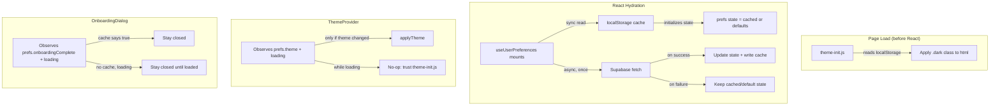
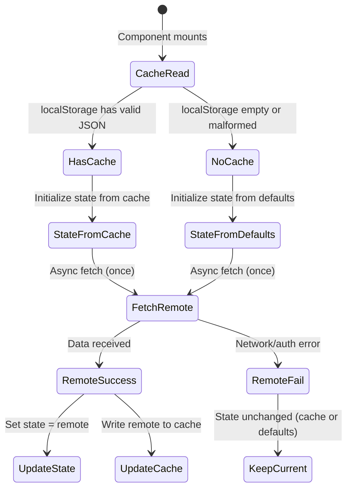

# Design Document

## Overview

This design addresses two related bugs in the Home OS preferences system:

1. **Onboarding dialog reappears** after the user has completed it
2. **Theme selection does not persist** across page reloads

Both bugs share a common root cause: the `useUserPreferences` hook is unstable. It calls `createClient()` (which creates a new Supabase client instance) on every render, causing the `useCallback` dependency to change, which re-triggers the `useEffect` that fetches preferences. During re-fetches, state briefly resets to defaults (`onboardingComplete: false`, `theme: "dark"`), causing the onboarding dialog to flash open and the theme to flicker.

A secondary issue is that the `ThemeProvider` unconditionally applies the theme when loading completes — even when `theme-init.js` has already correctly set the theme from cache. During the loading window (where state is defaults), this can override the correct theme with the default "dark".

### Fix Strategy

The fix stabilizes the hook by:
1. Memoizing the Supabase client reference outside the hook (singleton pattern already used by `createBrowserClient`)
2. Initializing state synchronously from `localStorage` cache instead of defaults
3. Using a `useRef` to prevent duplicate fetches
4. Making the `ThemeProvider` respect the already-applied theme during loading

## Architecture



## Components and Interfaces

### Modified: `hooks/use-user-preferences.ts`

The hook is the primary fix target. Changes:

| Aspect | Before (buggy) | After (fixed) |
|--------|----------------|---------------|
| Supabase client | Created inline each render | Stable reference via module-level singleton |
| Initial state | `defaultUserPreferences` | `readLocalCache() ?? defaultUserPreferences` |
| Fetch guard | None (re-triggers on dependency change) | `useRef` flag prevents duplicate fetches |
| `load` stability | Depends on `supabase` (unstable) | No external dependencies that change |

**New interface** (unchanged externally):

```typescript
export function useUserPreferences(): {
  prefs: UserPreferences;
  loading: boolean;
  update: (patch: Partial<UserPreferences>) => Promise<UserPreferences>;
  reload: () => Promise<void>;
}
```

**Internal changes:**

```typescript
// Module-level stable client (createBrowserClient already returns singleton internally)
const supabase = createClient();

export function useUserPreferences() {
  // Synchronous init from cache
  const [prefs, setPrefs] = useState<UserPreferences>(() => {
    return readLocalCache() ?? defaultUserPreferences;
  });
  const [loading, setLoading] = useState(true);
  const [userId, setUserId] = useState<string | null>(null);
  const hasFetched = useRef(false);

  const load = useCallback(async () => {
    if (hasFetched.current) return;
    hasFetched.current = true;
    setLoading(true);
    try {
      const { data: { user } } = await supabase.auth.getUser();
      if (!user) {
        setUserId(null);
        return;
      }
      setUserId(user.id);
      const remote = await fetchUserPreferences(supabase, user.id);
      setPrefs(remote);
      writeLocalCache(remote);
    } catch {
      // Keep current state (cache-initialized or defaults)
      console.warn("[preferences] Remote fetch failed, using cached/default values");
    } finally {
      setLoading(false);
    }
  }, []);

  useEffect(() => {
    void load();
  }, [load]);

  // ... update function unchanged
}
```

### Modified: `components/theme/theme-provider.tsx`

The `ThemeProvider` must not override the theme during loading, and must only apply the theme if it actually differs from what's currently on the DOM.

```typescript
export function ThemeProvider({ children }: { children: React.ReactNode }) {
  const { prefs, loading } = usePreferences();

  useEffect(() => {
    // Do nothing while loading — trust theme-init.js
    if (loading) return;
    if (!prefs.theme) return;

    // Only apply if different from current DOM state
    const currentlyDark = document.documentElement.classList.contains("dark");
    const resolved = resolveTheme(prefs.theme);
    if ((resolved === "dark") !== currentlyDark) {
      applyTheme(prefs.theme);
    }
  }, [loading, prefs.theme]);

  // ... media query listener unchanged
  return children;
}
```

### Modified: `components/onboarding/onboarding-dialog.tsx`

The dialog already checks `loading` and `prefs.onboardingComplete`. With the hook fix (initializing from cache), `prefs.onboardingComplete` will be `true` from the first render if the cache says so. No code change needed in the dialog itself — the fix is entirely in the hook's initialization.

### Unchanged: `public/theme-init.js`

The blocking script is already correct. It reads from `localStorage` and applies the theme before React hydrates. No changes needed.

### Unchanged: `lib/user-settings.ts`

The remote fetch/save functions are correct. No changes needed.

### New: `lib/preferences-cache.ts`

Extract cache read/write into a dedicated module for testability and reuse:

```typescript
import type { UserPreferences } from "@/types/user-preferences";
import { defaultUserPreferences } from "@/types/user-preferences";

export const LOCAL_PREFS_KEY = "home-os:preferences-cache";

export function readLocalCache(): UserPreferences | null {
  if (typeof window === "undefined") return null;
  try {
    const raw = localStorage.getItem(LOCAL_PREFS_KEY);
    if (!raw) return null;
    const parsed = JSON.parse(raw);
    if (!parsed || typeof parsed !== "object") return null;
    return parsed as UserPreferences;
  } catch {
    // Malformed JSON — discard
    localStorage.removeItem(LOCAL_PREFS_KEY);
    return null;
  }
}

export function writeLocalCache(prefs: UserPreferences): void {
  if (typeof window === "undefined") return;
  localStorage.setItem(LOCAL_PREFS_KEY, JSON.stringify(prefs));
}
```

## Data Models

No schema changes required. The existing data model is sufficient:

### `profiles.preferences` (JSONB column in Supabase)

```typescript
type UserPreferences = {
  onboardingComplete?: boolean;
  pinnedNoteIds?: string[];
  theme?: ThemePreference;        // "light" | "dark" | "auto"
  notifications?: NotificationPreferences;
};
```

### `localStorage` key: `home-os:preferences-cache`

Stores the full `UserPreferences` object as JSON. Acts as a synchronous read source on page load to prevent flicker.

### State Flow



## Correctness Properties

*A property is a characteristic or behavior that should hold true across all valid executions of a system — essentially, a formal statement about what the system should do. Properties serve as the bridge between human-readable specifications and machine-verifiable correctness guarantees.*

### Property 1: Update dual-write consistency

*For any* valid preference patch (theme, onboardingComplete, pinnedNoteIds, or notifications), calling the `update` function SHALL write the merged result to both the Local_Cache (localStorage) and the Remote_Store (Supabase), such that reading from either store returns the updated value.

**Validates: Requirements 1.1, 2.1**

### Property 2: Theme-init script applies correct theme from cache

*For any* valid theme value stored in the Local_Cache ("light", "dark", or "auto"), executing the theme-init script logic SHALL result in the `<html>` element having the `.dark` class if and only if the resolved theme is dark.

**Validates: Requirements 2.2**

### Property 3: Conditional theme application

*For any* combination of currently-applied DOM theme and fetched preference theme, the ThemeProvider SHALL call `applyTheme` only when the resolved fetched theme differs from the currently-applied theme.

**Validates: Requirements 2.3, 2.4**

### Property 4: Remote store is authoritative on conflict

*For any* pair of differing preference values where the Local_Cache contains value A and the Remote_Store contains value B, after the hook finishes loading, the hook's state and the Local_Cache SHALL both equal value B (the remote value).

**Validates: Requirements 2.5**

### Property 5: Synchronous cache initialization

*For any* valid UserPreferences object stored in the Local_Cache, the hook's initial state (before any async operation completes) SHALL equal the cached preferences, not the defaults.

**Validates: Requirements 3.1**

### Property 6: Optimistic update precedes remote write

*For any* valid preference patch, after calling `update`, the hook's state and Local_Cache SHALL reflect the patch immediately (before the remote write promise resolves).

**Validates: Requirements 3.4**

### Property 7: Remote fetch populates empty cache

*For any* valid UserPreferences returned by the Remote_Store, when the Local_Cache is initially empty, after the hook finishes loading, the Local_Cache SHALL contain the fetched preferences.

**Validates: Requirements 4.2**

## Error Handling

| Scenario | Behavior |
|----------|----------|
| Remote fetch fails (network error, auth expired) | Keep current state (cache-initialized or defaults). Log warning. Do not show onboarding. Do not change theme. |
| Remote write fails (on `update`) | Keep optimistic local state. Log warning via `console.warn`. Do not revert user-visible preference. |
| Malformed JSON in localStorage | Discard cache (`localStorage.removeItem`), use defaults, fetch from remote. |
| User not authenticated | Use cache if available, otherwise defaults. Skip remote fetch entirely. |
| `localStorage` unavailable (private browsing) | Catch errors silently, use defaults, fetch from remote if authenticated. |

## Testing Strategy

### Property-Based Tests

The feature involves pure logic (cache read/write, merge, conflict resolution, theme resolution) that is well-suited to property-based testing. Use **fast-check** as the PBT library for TypeScript.

Each property test runs a minimum of 100 iterations with generated inputs:

- **Property 1**: Generate random `Partial<UserPreferences>` patches, mock Supabase, verify both stores receive the merged result.
- **Property 2**: Generate random `ThemePreference` values, execute theme-init logic against a mock DOM, verify `.dark` class correctness.
- **Property 3**: Generate random (currentTheme, fetchedTheme) pairs, verify `applyTheme` is called only when they differ.
- **Property 4**: Generate random (cachePrefs, remotePrefs) pairs where they differ, verify remote wins.
- **Property 5**: Generate random valid `UserPreferences`, store in mock localStorage, verify hook initializes with cached value.
- **Property 6**: Generate random patches, verify state updates before promise resolves.
- **Property 7**: Generate random `UserPreferences` as remote response, verify cache is populated.

Tag format: `Feature: persist-settings-bugfix, Property {N}: {title}`

### Unit Tests (Example-Based)

- Onboarding dialog stays closed when cache has `onboardingComplete: true` (Req 1.2)
- Onboarding dialog stays closed during loading when no cache exists (Req 1.3)
- Hook fetches from remote exactly once per mount (Req 3.2)
- Hook does not re-fetch on parent re-renders (Req 3.3)
- Unauthenticated user uses cache without remote fetch (Req 4.4)

### Edge Case Tests

- Remote fetch fails with cache present → dialog stays closed (Req 1.4)
- Remote fetch fails with no cache → dialog stays closed, no error shown (Req 1.5)
- Remote write fails → optimistic state retained (Req 3.5)
- Malformed JSON in cache → graceful fallback to defaults (Req 4.3)

### Integration Tests

- Cross-tab storage event updates preferences on focus (Req 4.5)

### Test Configuration

```
Framework: Vitest
PBT Library: fast-check
Min iterations: 100 per property
```
