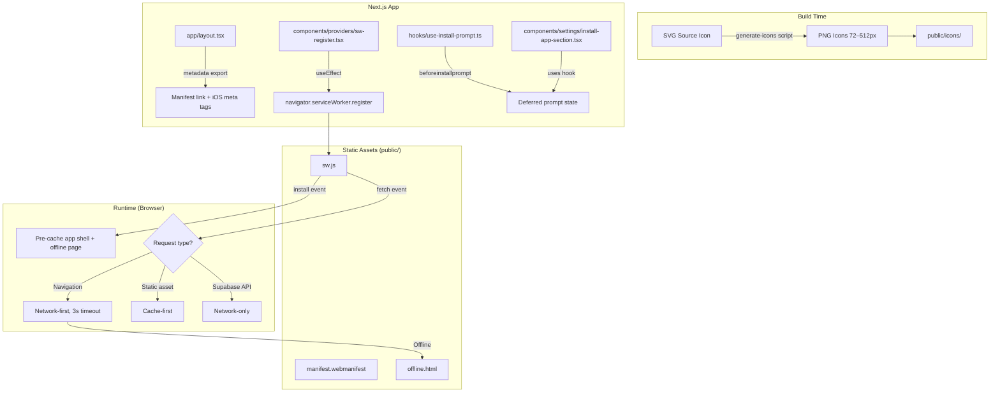

# Design Document: PWA Installable

## Overview

This design enables Home OS to be installed as a Progressive Web App on Android and iOS devices. The implementation adds a web app manifest, a service worker with offline caching, proper icon assets, iOS-specific meta tags, an install prompt hook with settings UI, an offline fallback page, and safe-area CSS for notched devices.

The approach is intentionally lightweight — no third-party PWA libraries (like `next-pwa`) are used. The service worker is a hand-written file in `public/sw.js` registered via a client component, keeping full control over caching strategies and avoiding build-time complexity. Icons are generated from a single SVG source using a build script.

### Key Design Decisions

1. **No `next-pwa` or `@serwist/next`** — These add Workbox and webpack plugin complexity. Our caching needs are simple (app shell + static assets), so a hand-written service worker is more maintainable and transparent.
2. **Service worker in `public/`** — Next.js serves files from `public/` at the root path. Placing `sw.js` there gives it the `/sw.js` URL and `/` scope without custom routing.
3. **Registration only in production** — Service workers cache aggressively, which interferes with hot-reload during development.
4. **Network-first for navigation** — Ensures users always get fresh content when online, with graceful offline fallback.
5. **Cache-first for static assets** — Fonts, icons, and images rarely change; serving from cache improves perceived performance.
6. **Network-only for Supabase API** — Data must always be fresh; caching API responses would cause stale state.

## Architecture



## Components and Interfaces

### 1. Web App Manifest (`public/manifest.webmanifest`)

A static JSON file served at `/manifest.webmanifest`. Referenced via Next.js metadata API in the root layout.

```json
{
  "name": "Home OS",
  "short_name": "Home OS",
  "description": "Your calm personal organization platform",
  "start_url": "/dashboard",
  "scope": "/",
  "display": "standalone",
  "theme_color": "#09090b",
  "background_color": "#09090b",
  "icons": [
    { "src": "/icons/icon-72x72.png", "sizes": "72x72", "type": "image/png", "purpose": "any" },
    { "src": "/icons/icon-96x96.png", "sizes": "96x96", "type": "image/png", "purpose": "any" },
    { "src": "/icons/icon-128x128.png", "sizes": "128x128", "type": "image/png", "purpose": "any" },
    { "src": "/icons/icon-144x144.png", "sizes": "144x144", "type": "image/png", "purpose": "any" },
    { "src": "/icons/icon-152x152.png", "sizes": "152x152", "type": "image/png", "purpose": "any" },
    { "src": "/icons/icon-192x192.png", "sizes": "192x192", "type": "image/png", "purpose": "any" },
    { "src": "/icons/icon-384x384.png", "sizes": "384x384", "type": "image/png", "purpose": "any" },
    { "src": "/icons/icon-512x512.png", "sizes": "512x512", "type": "image/png", "purpose": "any" },
    { "src": "/icons/icon-maskable-512x512.png", "sizes": "512x512", "type": "image/png", "purpose": "maskable" }
  ]
}
```

### 2. Service Worker (`public/sw.js`)

A vanilla JavaScript service worker implementing three caching strategies.

**Interface:**

```typescript
// Constants
const CACHE_VERSION = "home-os-v1";
const PRECACHE_URLS: string[]; // app shell resources + offline page

// Lifecycle events
self.addEventListener("install", (event: ExtendableEvent) => void);
self.addEventListener("activate", (event: ExtendableEvent) => void);
self.addEventListener("fetch", (event: FetchEvent) => void);

// Strategy functions
function networkFirst(request: Request, timeoutMs: number): Promise<Response>;
function cacheFirst(request: Request): Promise<Response>;
function networkOnly(request: Request): Promise<Response>;
```

**Caching strategies:**

| Request Type | Strategy | Behavior |
|---|---|---|
| Navigation (`mode: "navigate"`) | Network-first, 3s timeout | Try network → fall back to cached shell → fall back to offline page |
| Static assets (`/icons/`, fonts, images) | Cache-first | Serve from cache → fetch on miss and cache |
| Supabase API (`supabase.co`) | Network-only | Always fetch, never cache |
| Other requests | Network-first, no timeout | Try network → fall back to cache |

### 3. Service Worker Registration (`components/providers/sw-register.tsx`)

A client component that registers the service worker on mount. Included in the app providers tree.

```typescript
"use client";

export function ServiceWorkerRegister(): null {
  // useEffect: register /sw.js in production only
  // Handles: registration failure (console.error, no throw)
  // Returns: null (renders nothing)
}
```

### 4. Install Prompt Hook (`hooks/use-install-prompt.ts`)

A custom React hook that captures the `beforeinstallprompt` event and exposes install state.

```typescript
type InstallPromptState = {
  /** Whether the deferred prompt is available */
  canInstall: boolean;
  /** Whether the app is already running in standalone mode */
  isStandalone: boolean;
  /** Whether the install prompt is currently showing */
  isPrompting: boolean;
  /** Trigger the native install prompt */
  promptInstall: () => Promise<void>;
  /** Platform hint for manual instructions (ios | android | desktop | unknown) */
  platform: "ios" | "android" | "desktop" | "unknown";
};

export function useInstallPrompt(): InstallPromptState;
```

### 5. Install App Settings Section (`components/settings/install-app-section.tsx`)

A client component rendered in the settings page that shows install options.

```typescript
"use client";

export function InstallAppSection(): JSX.Element | null {
  // Uses useInstallPrompt() hook
  // Renders:
  //   - "Install App" button when canInstall is true
  //   - Manual instructions when on iOS (no beforeinstallprompt support)
  //   - Nothing when isStandalone is true
}
```

### 6. Offline Fallback Page (`public/offline.html`)

A self-contained HTML page (no external dependencies) that displays when the user is offline and no cached page is available. Uses inline styles matching the Home OS dark theme with monospace font.

### 7. Icon Generation Script (`scripts/generate-icons.ts`)

A Node.js script that takes a source SVG and generates all required PNG sizes using the `sharp` library (dev dependency).

```typescript
// Input: public/icons/icon-source.svg
// Output: public/icons/icon-{size}x{size}.png for each required size
// Also generates: public/icons/icon-maskable-512x512.png (with padding for safe zone)
// Also generates: public/icons/apple-touch-icon.png (180x180)
```

### 8. Root Layout Metadata Updates (`app/layout.tsx`)

The root layout's `metadata` export is extended with manifest link, iOS meta tags, theme-color, and viewport configuration using Next.js Metadata API.

```typescript
export const metadata: Metadata = {
  title: "Home OS",
  description: "Your calm personal dashboard for mind, tasks, people, and media",
  manifest: "/manifest.webmanifest",
  appleWebApp: {
    capable: true,
    statusBarStyle: "black-translucent",
    title: "Home OS",
  },
  other: {
    "mobile-web-app-capable": "yes",
  },
};

export const viewport: Viewport = {
  width: "device-width",
  initialScale: 1,
  viewportFit: "cover",
  themeColor: [
    { media: "(prefers-color-scheme: light)", color: "#f4f4f5" },
    { media: "(prefers-color-scheme: dark)", color: "#09090b" },
  ],
};
```

## Data Models

This feature does not introduce any database tables or persistent server-side state. All state is client-side:

### Client-Side State

```typescript
/** Stored in memory via the useInstallPrompt hook (Zustand not needed — component-local) */
type InstallPromptMemoryState = {
  deferredPrompt: BeforeInstallPromptEvent | null;
  isPrompting: boolean;
};

/** BeforeInstallPromptEvent — browser-provided, not in standard TypeScript lib */
interface BeforeInstallPromptEvent extends Event {
  readonly platforms: string[];
  readonly userChoice: Promise<{ outcome: "accepted" | "dismissed"; platform: string }>;
  prompt(): Promise<void>;
}
```

### Cache Storage (Service Worker)

```typescript
/** Cache names used by the service worker */
const CACHE_VERSION = "home-os-v1"; // Versioned for cache busting on deploy

/** Pre-cached resources (total < 2MB) */
const PRECACHE_URLS = [
  "/offline.html",
  // CSS and JS bundles are added at build time or via a manifest
];
```

### File System Artifacts

| File | Location | Purpose |
|---|---|---|
| `manifest.webmanifest` | `public/` | W3C web app manifest |
| `sw.js` | `public/` | Service worker |
| `offline.html` | `public/` | Offline fallback page |
| `icons/icon-*.png` | `public/icons/` | App icons (72–512px) |
| `icons/icon-maskable-512x512.png` | `public/icons/` | Maskable icon for Android |
| `icons/apple-touch-icon.png` | `public/icons/` | iOS home screen icon (180px) |
| `icons/icon-source.svg` | `public/icons/` | Source SVG for icon generation |


## Correctness Properties

*A property is a characteristic or behavior that should hold true across all valid executions of a system — essentially, a formal statement about what the system should do. Properties serve as the bridge between human-readable specifications and machine-verifiable correctness guarantees.*

### Property 1: Manifest icon entries are structurally valid

*For any* icon entry in the manifest's `icons` array, the entry SHALL contain a `src` field that is a non-empty string starting with "/", a `sizes` field matching the pattern `NxN` where N is a positive integer, a `type` field equal to "image/png", and a `purpose` field that is either "any" or "maskable".

**Validates: Requirements 2.3**

### Property 2: Service worker applies correct caching strategy based on request classification

*For any* fetch request intercepted by the service worker: if the request mode is "navigate", the network-first strategy with 3-second timeout SHALL be applied; if the request URL matches a static asset pattern (paths under `/icons/`, font files, or image files), the cache-first strategy SHALL be applied; if the request URL contains the Supabase API hostname, the network-only strategy SHALL be applied.

**Validates: Requirements 4.2, 4.3, 4.4**

### Property 3: Install option visibility when installable and not standalone

*For any* application state where the deferred install prompt is available (`canInstall` is true) and the app is NOT running in standalone display mode (`isStandalone` is false), the "Install App" option SHALL be visible in the settings page.

**Validates: Requirements 6.2**

### Property 4: Install option hidden in standalone mode

*For any* application state where the app is running in standalone display mode (`isStandalone` is true), the "Install App" option SHALL NOT be visible in the settings page, regardless of whether a deferred prompt is available.

**Validates: Requirements 6.6**

### Property 5: Manual install instructions completeness

*For any* platform where the `beforeinstallprompt` event is not supported and the app is not running in standalone mode, the settings page SHALL display manual installation instructions containing: the platform name (e.g., "iOS"), and at minimum 2 numbered steps describing the installation process.

**Validates: Requirements 6.7**

### Property 6: Safe-area padding applied to fixed layout elements

*For any* fixed-position layout element (sidebar, header) and the outermost app shell container, the computed CSS SHALL include `env(safe-area-inset-top)`, `env(safe-area-inset-bottom)`, `env(safe-area-inset-left)`, and `env(safe-area-inset-right)` padding rules to prevent content from being obscured by device notches or system UI.

**Validates: Requirements 7.2**

## Error Handling

### Service Worker Registration Errors

| Error Scenario | Handling |
|---|---|
| Browser doesn't support Service Worker API | Skip registration silently; app functions normally without offline support |
| `navigator.serviceWorker.register()` rejects | Log error to `console.error`; do not throw, do not show UI error |
| Service worker script fails to parse | Browser handles internally; registration promise rejects (caught as above) |

### Service Worker Fetch Errors

| Error Scenario | Handling |
|---|---|
| Network timeout on navigation (>3s) | Serve cached app shell; if no cache, serve `offline.html` |
| Network failure on static asset | Serve from cache if available; if not cached, let request fail naturally |
| Network failure on Supabase API | Let request fail; app-level error handling (toast notifications) handles this |
| Cache storage full | `cache.put()` may fail silently; service worker continues without caching |

### Install Prompt Errors

| Error Scenario | Handling |
|---|---|
| `prompt()` throws (rare edge case) | Catch error, re-enable install button, log to console |
| `userChoice` promise never resolves | No timeout needed; button remains disabled until page reload |
| `beforeinstallprompt` never fires | Hook returns `canInstall: false`; UI shows manual instructions if not standalone |

### Icon Generation Errors

| Error Scenario | Handling |
|---|---|
| Source SVG missing | Script exits with non-zero code and descriptive error message |
| `sharp` not installed | Script checks for dependency and provides install instructions |
| Output directory not writable | Script throws with path information |

## Testing Strategy

### Unit Tests (Example-Based)

Unit tests verify specific, concrete behaviors:

1. **Manifest validation** — Parse `manifest.webmanifest` and assert all required fields have correct values (name, short_name, display, start_url, scope, theme_color, background_color)
2. **Service worker registration** — Mock `navigator.serviceWorker` and verify:
   - Registration called with correct path and scope in production
   - Registration skipped in development
   - Registration skipped when API unavailable
   - Errors caught and logged
3. **Service worker lifecycle** — Verify `skipWaiting()` called on install, `clients.claim()` called on activate, old caches deleted on activate
4. **Install prompt hook** — Test state transitions:
   - Initial state (canInstall=false, isStandalone detection)
   - After beforeinstallprompt (canInstall=true)
   - After prompt accepted (canInstall=false)
   - After prompt dismissed (canInstall=true, re-enabled)
5. **Offline page content** — Parse HTML and verify required elements
6. **Metadata output** — Verify root layout metadata includes all required iOS meta tags and manifest link

### Property-Based Tests (fast-check)

Property tests verify universal properties across generated inputs. Each test runs a minimum of 100 iterations.

| Property | Test Approach |
|---|---|
| P1: Icon entry structure | Generate random icon entries, validate against schema |
| P2: Request routing | Generate random URLs/request modes, verify correct strategy selection |
| P3: Install visibility (installable) | Generate random combinations of canInstall=true + isStandalone=false states, verify button renders |
| P4: Install hidden (standalone) | Generate random states with isStandalone=true, verify button never renders |
| P5: Manual instructions | Generate random platform strings for unsupported browsers, verify instructions contain platform + ≥2 steps |
| P6: Safe-area padding | Generate random fixed-position element selectors, verify CSS contains all four env() padding rules |

**PBT Library:** fast-check (already in devDependencies)

**Tag format:** Each property test includes a comment:
```
// Feature: pwa-installable, Property N: <property text>
```

### Integration Tests

- Verify `manifest.webmanifest` is served at the correct URL with `Content-Type: application/manifest+json`
- Verify `sw.js` is served at `/sw.js`
- Verify all icon files referenced in the manifest exist and are valid PNGs
- Verify offline.html is served correctly

### Smoke Tests

- Icon files exist at all required sizes
- Apple-touch-icon file exists at the referenced path
- Manifest file is valid JSON
